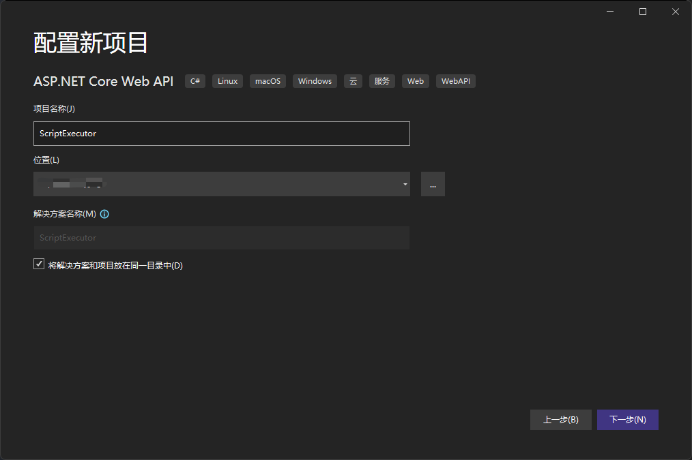
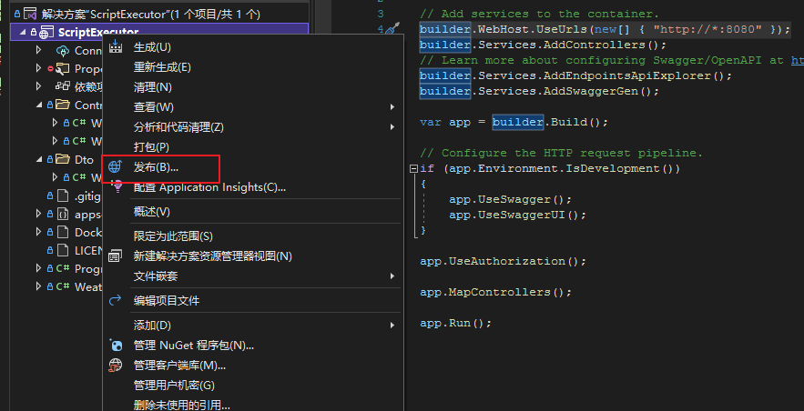
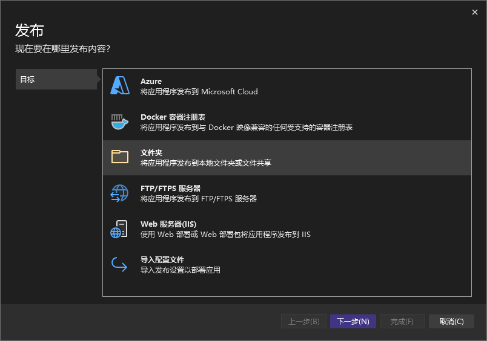
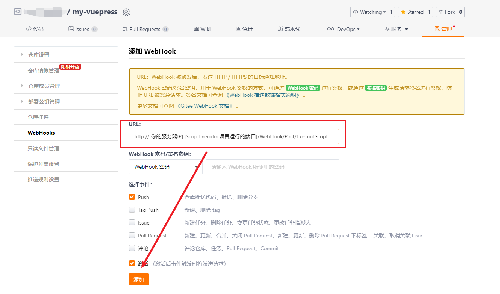

通过gitee仓库的WebHook回调实现VuePress项目的自动化部署

<!-- more -->

## [在Linux上部署VuePress](/docs/about-this-website/vuepress-release.md)

## 新建脚本文件

1. 在VuePress项目根目录中新建shell脚本文件 `start.sh`
2. 编辑start.sh脚本文件并上传至git仓库

   ```shell
     #!/bin/bash
     # 切入源码目录，以确保能正常执行
     cd /home/my/my-vuepress

     # 拉取最新代码
     git pull

     # 杀死目前已启动进程
     ID=`ps -ef|grep node | grep vuepress|awk '{print $2}'`
     echo --- the process is $ID ---
     kill -9  $ID
     echo  "Killed $ID"
     # 更新包
     npm i
     # 后台启动
     nohup npm run pro&
   ```
3. 在Linux上拉取更新

   ```shell
   cd /home/my/my-vuepress
   git pull
   ```
4. 为脚本文件授予权限

   ```shell
   chmod 775 /home/my/my-vuepress/start.sh
   ```

## 编写接口用于在接口调用时执行脚本

**此处以Asp.Net Core Web Api为例**

1. 打开VS2022，选择Asp.Net Core Web Api项目

   
2. 为项目命名，勾选'将解决方案和项目放在同一目录'

   
3. 框架选择.NET6.0

   
4. 在Controllers文件夹下新建WebHookController.cs

   ```c#
   namespace ScriptExecutor.Controllers
   {
       [ApiController]
       [Route("[controller]/[action]")]
       public class WebHookController : ControllerBase
       {
           [HttpPost("ExecoutScript")]
           public string Post([FromBody] object inDto)
           {
               try
               {
                   Process.Start("./start.sh");
                   return "执行成功！";
               }
               catch (Exception ex)
               {
                   return $"执行失败：{ex.Message}";
               }
           }
       }
   }
   ```
5. 在Program.cs类中，配置项目的启动端口

   ```c#
   builder.WebHost.UseUrls(new[] { "http://*:8080" });
   ```

## 发布项目

1. 右键项目，选择'发布'

   
2. 选择'文件夹'，直接点击'下一步'——>'完成'

   

   
3. 点击'发布'

   

## 部署回调接口

1. 将bin\Release\net6.0\publish\publish文件夹的下的所有项目上传至linux服务器中的/home/my/script-executor文件夹下
2. [在Linux上安装.Net6环境](/docs/linux/installation-dotnet.md)
3. 进入home/my/my-vuepress路径下

   ```shell
   cd /home/my/my-vuepress
   ```
4. 运行ScriptExecutor项目

   ```shell
   dotnet /home/my/script-executor/ScriptExecutor.dll
   ```
5. 配置git仓库的WebHook，使其在推送代码时自动触发接口(此处以gitee为例)

   
   6. 配置webhook的回调地址

   

   7. 测试效果

      

      **返回执行成功，说明脚本已成功执行，之后提交代码时，便会通过webhook回调接口去触发脚本的执行，从而实现vuepress的自动发布**

## 设置项目开机启动

1. 在linux服务器root目录下新建start.sh脚本

   ```shell
   #!/bin/bash
   # 切入源码目录，以确保能正常执行
   cd /home/my/my-blog
   # 启动webhook接口
   nohup  dotnet /home/my/script-executor/ScriptExecutor.dll
   # 拉取最新代码1
   git pull

   # 杀死目前已启动进程
   ID=`ps -ef|grep node | grep vuepress|awk '{print $2}'`
   echo --- the process is $ID ---
   kill -9  $ID
   echo  "Killed $ID"
   # 更新包
   yarn
   # 启动
   nohup yarn pro&
   
   ```
2. [在Linux上设置shell脚本开机启动](/docs/linux/boot-up-script.md)
