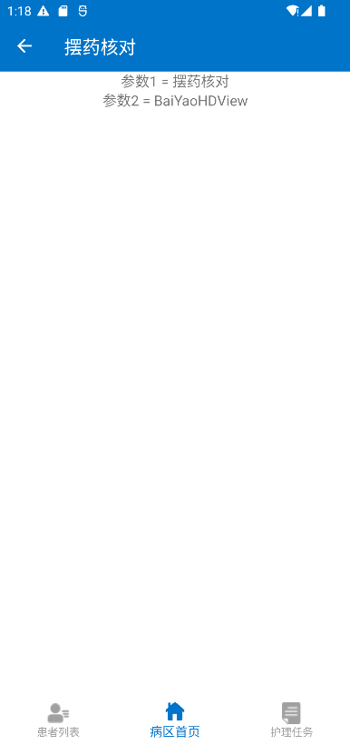
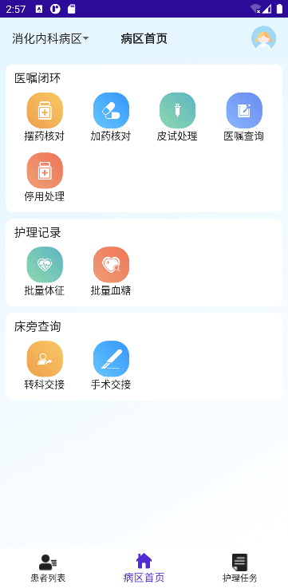
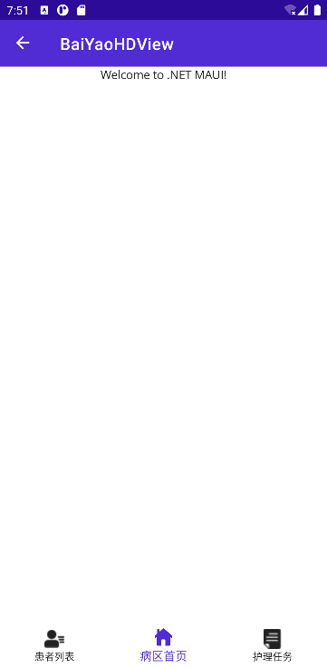

::: tip ✨✨✨✨✨
编码实战
:::

<!-- more -->

## 目标效果




图标素材库：[https://www.iconfont.cn/](https://www.iconfont.cn/)

## 结构划分


## 内容页

内容页主要有三个板块构成，每个板块内部有属于该板块的菜单项，单纯从显示效果上看有很多控件可以实现类似的效果，比如 Grid、HorizontalStackLayout、VerticalStackLayout、FlexLayout等。但是通常像这样的菜单结构并不是一成不变的，我们的板块或者板块内的菜单随时都可能有增减，或者根据权限有选择性的展示，这就意味着该页面的结构和内容是动态的，这时候我们就需要从后端获取当前要展示的菜单数据，并且选择那些支持动态渲染的控件来呈现在页面上。

### 准备数据源

```csharp
namespace Mediinfo_MAUI_Demo.Models;

public class MenuGroupModel
{
    public string Name { get; set; }
    public List<Menu> Menus { get; set; }
}
public class Menu
{
    public string Name { get; set; }
    public string Path { get; set; }
    public Color StartPointColor { get; set; }
    public Color EndPointColor { get; set; }
    public ImageSource ImageSource { get; set; }
}

```

### 填充数据

```csharp
using CommunityToolkit.Mvvm.ComponentModel;
using Mediinfo_MAUI_Demo.Models;

namespace Mediinfo_MAUI_Demo.ViewModels;

public partial class MainPageViewModel : ObservableObject
{
    public List<MenuGroupModel> MenuGroups { get; set; } = new();

    public MainPageViewModel()
    {
        MenuGroups = new()
        {
            new MenuGroupModel
            {
                Name= "医嘱闭环",
                Menus=new()
                {
                    new Menu
                    {
                        Name="摆药核对",
                        Path="BaiYaoHDView",
                        ImageSource="baiyaohedui.svg",
                        StartPointColor=Color.FromArgb("#f7c563"),
                        EndPointColor=Color.FromArgb("#ee9f4a")
                    },
                    new Menu
                    {
                        Name = "加药核对",
                        Path="BaiYaoHDView",
                        ImageSource = "jiayaohedui.svg",
                        StartPointColor = Color.FromArgb("#399afa"),
                        EndPointColor = Color.FromArgb("#66c7ff")
                    },
                    new Menu
                    {
                        Name = "皮试处理",
                        Path="BaiYaoHDView",
                        ImageSource = "pishichuli.svg",
                        StartPointColor = Color.FromArgb("#61b8c0"),
                        EndPointColor = Color.FromArgb("#8dd9af")
                    },
                    new Menu
                    {
                        Name = "医嘱查询",
                        Path="BaiYaoHDView",
                        ImageSource = "yizhuchaxun.svg",
                        StartPointColor = Color.FromArgb("#6c90f2"),
                        EndPointColor = Color.FromArgb("#88b6fb")
                    },
                    new Menu
                    {
                        Name = "停用处理",
                        Path="BaiYaoHDView",
                        ImageSource = "baiyaohedui.svg",
                        StartPointColor = Color.FromArgb("#ef785a"),
                        EndPointColor = Color.FromArgb("#efa079")
                    }
                }
            },
            new MenuGroupModel
            {
                Name="护理记录",
                Menus=new()
                {
                    new Menu
                    {
                        Name = "批量体征",
                        Path="BaiYaoHDView",
                        ImageSource = "piliangtizheng.svg",
                        StartPointColor = Color.FromArgb("#61b8c0"),
                        EndPointColor = Color.FromArgb("#8dd9af")
                    },
                    new Menu
                    {
                        Name = "批量血糖",
                        Path="BaiYaoHDView",
                        ImageSource = "piliangxuetang.svg",
                        StartPointColor = Color.FromArgb("#ef785a"),
                        EndPointColor = Color.FromArgb("#efa079")
                    }

                }
            },
            new MenuGroupModel
            {
                Name="床旁查询",
                Menus = new()
                {
                    new Menu
                    {
                        Name = "转科交接",
                        Path="BaiYaoHDView",
                        ImageSource = "zhuankejiaojie.svg",
                        StartPointColor = Color.FromArgb("#f7c563"),
                        EndPointColor = Color.FromArgb("#ee9f4a")
                    },
                    new Menu
                    {
                        Name = "手术交接",
                        Path="BaiYaoHDView",
                        ImageSource = "shoushujiaojie.svg",
                        StartPointColor = Color.FromArgb("#399afa"),
                        EndPointColor = Color.FromArgb("#66c7ff")
                    }
                }
            }
        };
    }
}
```

### 页面呈现

#### 菜单分组

```xml
<?xml version="1.0" encoding="utf-8" ?>
<ContentPage xmlns="http://schemas.microsoft.com/dotnet/2021/maui"
             xmlns:x="http://schemas.microsoft.com/winfx/2009/xaml"
             xmlns:controls="clr-namespace:Mediinfo_MAUI_Demo.Controls"
             xmlns:model="clr-namespace:Mediinfo_MAUI_Demo.Models"
             xmlns:viewmodel="clr-namespace:Mediinfo_MAUI_Demo.ViewModels"
             x:Class="Mediinfo_MAUI_Demo.MainPage"
             x:DataType="viewmodel:MainPageViewModel">

    <Border StrokeThickness="0">
        <Border.Background>
            <LinearGradientBrush>
                <GradientStop Color="#e6f6ff"
                          Offset="0.1" />
                <GradientStop Color="Transparent"
                          Offset="1.0" />
            </LinearGradientBrush>
        </Border.Background>
        <VerticalStackLayout  
            BindableLayout.ItemsSource="{Binding MenuGroups}"
            Spacing="8"
            Padding="8">
            <BindableLayout.ItemTemplate>
                <DataTemplate x:DataType="model:MenuGroupModel">
                    <Border Padding="8" StrokeThickness="0">
                        <Border.StrokeShape>
                            <RoundRectangle CornerRadius="10,10,10,10"/>
                        </Border.StrokeShape>
                        <VerticalStackLayout>
                            <Label 
                            HorizontalOptions="Start" 
                            Text="{Binding Name}"
                            FontSize="16"
                            HeightRequest="22"
                            TextColor="#ff222222"
                            Margin="4,0,0,0"/>
                            <Label Text="这里是菜单按钮"/>
                        </VerticalStackLayout>
                    </Border>
                </DataTemplate>
            </BindableLayout.ItemTemplate>
        </VerticalStackLayout>
    </Border>

</ContentPage>
```

:::info
`Border.Background.LinearGradientBrush` 为边框填充一个渐变背景色

`Border.VerticalStackLayout.BindableLayout.ItemsSource` 将前边准备的数据设置为垂直布局的数据源

`Border.VerticalStackLayout.BindableLayout.ItemTemplate` 定义子数据外观模板
:::

效果：


#### 菜单项

##### 自定义菜单项控件模板

::: code-tabs
@tab MenuButtonControl.xaml.cs
```csharp
namespace Mediinfo_MAUI_Demo.Controls;

public partial class MenuButtonControl : ContentView
{
    public static readonly BindableProperty StartPointColorProperty = BindableProperty.Create(nameof(StartPointColor), typeof(Color), typeof(MenuButtonControl), null);
    public static readonly BindableProperty EndPointColorProperty = BindableProperty.Create(nameof(EndPointColor), typeof(Color), typeof(MenuButtonControl), null);
    public static readonly BindableProperty ImageSourceProperty = BindableProperty.Create(nameof(ImageSource), typeof(string), typeof(MenuButtonControl), string.Empty);
    public static readonly BindableProperty PathProperty = BindableProperty.Create(nameof(Path), typeof(string), typeof(MenuButtonControl), string.Empty);
    public static readonly BindableProperty TextProperty = BindableProperty.Create(nameof(Text), typeof(string), typeof(MenuButtonControl), string.Empty);

    public Color StartPointColor
    {
        get => (Color)GetValue(StartPointColorProperty);
        set => SetValue(StartPointColorProperty, value);
    }

    public Color EndPointColor
    {
        get => (Color)GetValue(EndPointColorProperty);
        set => SetValue(EndPointColorProperty, value);
    }
    public string ImageSource
    {
        get => (string)GetValue(ImageSourceProperty);
        set => SetValue(ImageSourceProperty, value);
    }
    public string Path
    {
        get => (string)GetValue(PathProperty);
        set => SetValue(PathProperty, value);
    }
    public string Text
    {
        get => (string)GetValue(TextProperty);
        set => SetValue(TextProperty, value);
    }
    public MenuButtonControl()
	{
		InitializeComponent();
	}
}
```
@tab MenuButtonControl.xaml
```xml
<?xml version="1.0" encoding="utf-8" ?>
<ContentView xmlns="http://schemas.microsoft.com/dotnet/2021/maui"
             xmlns:x="http://schemas.microsoft.com/winfx/2009/xaml"
             x:Class="Mediinfo_MAUI_Demo.Controls.MenuButtonControl"
             x:Name="this"
             BindingContext="{x:Reference this}">
    <VerticalStackLayout
        HeightRequest="74"
        WidthRequest="56">
        <Border
            HeightRequest="50"
            WidthRequest="50"
            Padding="10"
            StrokeThickness="0"
            HorizontalOptions="Center"
            StrokeShape="RoundRectangle 20">
            <Border.Background>
                <LinearGradientBrush StartPoint="1,0" EndPoint="0,1">
                    <GradientStop Color="{Binding Source={x:Reference this},Path=StartPointColor}"
                          Offset="0.1" />
                    <GradientStop Color="{Binding Source={x:Reference this},Path=EndPointColor}"
                          Offset="1.0" />
                </LinearGradientBrush>
            </Border.Background>
            <Image Source="{Binding Source={x:Reference this},Path=ImageSource}"/>
        </Border>
        <Label 
            HeightRequest="20"
            FontSize="14"
            TextColor="#ff222222"
            Text="{Binding Source={x:Reference this},Path=Text}"/>
    </VerticalStackLayout>
</ContentView>
```
:::

##### 使用自定义控件呈现分组菜单项

```xml
<?xml version="1.0" encoding="utf-8" ?>
<ContentPage xmlns="http://schemas.microsoft.com/dotnet/2021/maui"
             xmlns:x="http://schemas.microsoft.com/winfx/2009/xaml"
             xmlns:controls="clr-namespace:Mediinfo_MAUI_Demo.Controls"
             xmlns:model="clr-namespace:Mediinfo_MAUI_Demo.Models"
             xmlns:viewmodel="clr-namespace:Mediinfo_MAUI_Demo.ViewModels"
             x:Class="Mediinfo_MAUI_Demo.MainPage"
             x:DataType="viewmodel:MainPageViewModel">

    <Border StrokeThickness="0">
        <Border.Background>
            <LinearGradientBrush>
                <GradientStop Color="#e6f6ff"
                          Offset="0.1" />
                <GradientStop Color="Transparent"
                          Offset="1.0" />
            </LinearGradientBrush>
        </Border.Background>
        <VerticalStackLayout  
            BindableLayout.ItemsSource="{Binding MenuGroups}"
            Spacing="8"
            Padding="8">
            <BindableLayout.ItemTemplate>
                <DataTemplate x:DataType="model:MenuGroupModel">
                    <Border Padding="8" StrokeThickness="0">
                        <Border.StrokeShape>
                            <RoundRectangle CornerRadius="10,10,10,10"/>
                        </Border.StrokeShape>
                        <VerticalStackLayout>
                            <Label 
                            HorizontalOptions="Start" 
                            Text="{Binding Name}"
                            FontSize="16"
                            HeightRequest="22"
                            TextColor="#ff222222"
                            Margin="4,0,0,0"/>
                            <CollectionView ItemsSource="{Binding Menus}" Margin="0,8,0,0">
                                <CollectionView.ItemsLayout>
                                    <GridItemsLayout 
                                    Orientation="Vertical" 
                                    Span="4"
                                    VerticalItemSpacing="8"></GridItemsLayout>
                                </CollectionView.ItemsLayout>
                                <CollectionView.ItemTemplate>
                                    <DataTemplate x:DataType="model:Menu">
                                        <controls:MenuButtonControl
                                            ImageSource="{Binding ImageSource}"
                                            StartPointColor="{Binding StartPointColor}"
                                            EndPointColor="{Binding EndPointColor}"
                                            Text="{Binding Name}">
                                        </controls:MenuButtonControl>
                                    </DataTemplate>
                                </CollectionView.ItemTemplate>
                            </CollectionView>
                        </VerticalStackLayout>
                    </Border>
                </DataTemplate>
            </BindableLayout.ItemTemplate>
        </VerticalStackLayout>
    </Border>
</ContentPage>
```

:::info
CollectionView.ItemsSource 将每个分组下的菜单项List作为数据源绑定

CollectionView.ItemsLayout 定义子数据的布局

CollectionView.ItemTemplate 定义子数据外观模板
:::

效果：


## 标题栏

标题栏的结构布局经常是统一的，但文字及颜色可能又会随页面发生改变，所以我们可以将顶部标题栏也封装为一个自定义控件供多个页面使用。

### 创建自定义标题栏控件

新建 ContentView 文件

::: code-tabs
@tab:active MainPageTitleView.xaml
```xml
<?xml version="1.0" encoding="utf-8" ?>
<ContentView xmlns="http://schemas.microsoft.com/dotnet/2021/maui"
             xmlns:x="http://schemas.microsoft.com/winfx/2009/xaml"
             x:Class="Mediinfo_MAUI_Demo.Controls.MainPageTitleView"
             x:Name="this"
             BindingContext="{x:Reference this}">
    <Grid
        x:Name="grid"
        BackgroundColor ="Transparent"
        Padding="0,0,16,0">
        <Grid.ColumnDefinitions>
            <ColumnDefinition Width="1*"/>
            <ColumnDefinition Width="1*"/>
            <ColumnDefinition Width="1*"/>
        </Grid.ColumnDefinitions>
        <HorizontalStackLayout HorizontalOptions="Start">
            <Label 
                HorizontalOptions="Start" 
                VerticalOptions="Center"
                TextColor="#222222"
                FontSize="16"
                Text="{Binding Text}"/>
            <Image HorizontalOptions="Start" VerticalOptions="Center" Source="xiajiantou.svg" WidthRequest="10"/>
        </HorizontalStackLayout>
        <Label 
            Grid.Column="1"
            Text="{Binding Title}"
            TextColor="#222222"
            FontSize="16"
            FontAttributes="Bold"
            HorizontalOptions="Center"
            VerticalOptions="Center"/>
        <Image  
            Grid.Column="2"
            HeightRequest="34"
            HorizontalOptions="End" 
            VerticalOptions="Center"
            Source="touxiang.svg"/>
    </Grid>
</ContentView>
```
@tab MainPageTitleView.xaml.cs
```csharp
namespace Mediinfo_MAUI_Demo.Controls;

public partial class MainPageTitleView : ContentView
{
    public static readonly BindableProperty TextProperty = BindableProperty.Create(nameof(Text), typeof(string), typeof(MainPageTitleView), string.Empty);
    public static readonly BindableProperty TitleProperty = BindableProperty.Create(nameof(Title), typeof(string), typeof(MainPageTitleView), string.Empty);

    public string Title
    {
        get => (string)GetValue(TitleProperty);
        set => SetValue(TitleProperty, value);
    }
    public string Text
    {
        get => (string)GetValue(TextProperty);
        set => SetValue(TextProperty, value);
    }
    public MainPageTitleView()
	{
		InitializeComponent();
	}
}
```
:::

### 引入自定义标题栏

```xml
<?xml version="1.0" encoding="utf-8" ?>
<ContentPage xmlns="http://schemas.microsoft.com/dotnet/2021/maui"
             xmlns:x="http://schemas.microsoft.com/winfx/2009/xaml"
             xmlns:controls="clr-namespace:Mediinfo_MAUI_Demo.Controls"
             xmlns:model="clr-namespace:Mediinfo_MAUI_Demo.Models"
             xmlns:viewmodel="clr-namespace:Mediinfo_MAUI_Demo.ViewModels"
             x:Class="Mediinfo_MAUI_Demo.MainPage"
             x:DataType="viewmodel:MainPageViewModel">

    <Shell.BackgroundColor>
        <Color>#e6f6ff</Color>
    </Shell.BackgroundColor>
    <Shell.TitleView>
        <controls:MainPageTitleView Title="病区首页" Text="消化内科病区"/>
    </Shell.TitleView>
  <!--其他代码-->
</ContentPage>
```

效果：



## 页面导航

### 创建目标内容页

创建摆药核对的ContentPage页面：BaiYaoHDView.xaml

### 注册路由

在 AppShell.xaml.cs 中注册摆药核对页面的路由

```csharp
using Mediinfo_MAUI_Demo.Views;

namespace Mediinfo_MAUI_Demo;

public partial class AppShell : Shell
{
	public AppShell()
	{
		InitializeComponent();
        Routing.RegisterRoute(nameof(BaiYaoHDView), typeof(BaiYaoHDView));
    }
}
```

### 页面跳转

#### 定义跳转事件

```csharp
using CommunityToolkit.Mvvm.ComponentModel;
using Mediinfo.Vela.YiDongHL.App.Models;
using System;
using System.Collections.Generic;
using CommunityToolkit.Mvvm;
using CommunityToolkit.Mvvm.Input;

namespace Mediinfo.Vela.YiDongHL.App.ViewModels
{
    public partial class MainPageViewModel : ViewModelBase
    {
        //其他代码
        [RelayCommand]
        private async Task Tab(Menu menu)
        {
            await Shell.Current.GoToAsync(menu.Path);
        }
    }
}
```

**`Shell.Current.GoToAsync()`** 为MAUI提供的页面跳转方法，入参数为目标页面的路由地址(与注册路由时的地址保持一致)

#### 绑定跳转事件

```xml
<?xml version="1.0" encoding="utf-8" ?>
<ContentPage xmlns="http://schemas.microsoft.com/dotnet/2021/maui"
             xmlns:x="http://schemas.microsoft.com/winfx/2009/xaml"
             xmlns:controls="clr-namespace:Mediinfo_MAUI_Demo.Controls"
             xmlns:model="clr-namespace:Mediinfo_MAUI_Demo.Models"
             xmlns:viewmodel="clr-namespace:Mediinfo_MAUI_Demo.ViewModels"
             x:Class="Mediinfo_MAUI_Demo.MainPage"
             x:DataType="viewmodel:MainPageViewModel"
             x:Name="this">

    <Shell.BackgroundColor>
        <Color>#e6f6ff</Color>
    </Shell.BackgroundColor>
    <Shell.TitleView>
        <controls:MainPageTitleView Title="病区首页" Text="消化内科病区"/>
    </Shell.TitleView>
    <Border StrokeThickness="-1">
        <Border.Background>
            <LinearGradientBrush>
                <GradientStop Color="#e6f6ff"
                          Offset="0.1" />
                <GradientStop Color="Transparent"
                          Offset="1.0" />
            </LinearGradientBrush>
        </Border.Background>
        <VerticalStackLayout  
            BindableLayout.ItemsSource="{Binding MenuGroups}"
            Spacing="8"
            Padding="8">
            <BindableLayout.ItemTemplate>
                <DataTemplate x:DataType="model:MenuGroupModel">
                    <Border Padding="8" StrokeThickness="0">
                        <Border.StrokeShape>
                            <RoundRectangle CornerRadius="10,10,10,10"/>
                        </Border.StrokeShape>
                        <VerticalStackLayout>
                            <Label 
                            HorizontalOptions="Start" 
                            Text="{Binding Name}"
                            FontSize="16"
                            HeightRequest="22"
                            TextColor="#ff222222"
                            Margin="4,0,0,0"/>
                            <CollectionView ItemsSource="{Binding Menus}" Margin="0,8,0,0">
                                <CollectionView.ItemsLayout>
                                    <GridItemsLayout 
                                    Orientation="Vertical" 
                                    Span="4"
                                    VerticalItemSpacing="8"></GridItemsLayout>
                                </CollectionView.ItemsLayout>
                                <CollectionView.ItemTemplate>
                                    <DataTemplate x:DataType="model:Menu">
                                        <controls:MenuButtonControl
                                            ImageSource="{Binding ImageSource}"
                                            StartPointColor="{Binding StartPointColor}"
                                            EndPointColor="{Binding EndPointColor}"
                                            Text="{Binding Name}">
                                            <controls:MenuButtonControl.GestureRecognizers>
                                                <TapGestureRecognizer 
                                                    Command="{Binding Source={x:Reference this},Path=BindingContext.GotoCommand}"
                                                    CommandParameter="{Binding}"/>
                                            </controls:MenuButtonControl.GestureRecognizers>
                                        </controls:MenuButtonControl>
                                    </DataTemplate>
                                </CollectionView.ItemTemplate>
                            </CollectionView>
                        </VerticalStackLayout>
                    </Border>
                </DataTemplate>
            </BindableLayout.ItemTemplate>
        </VerticalStackLayout>
    </Border>
</ContentPage>
```

**`controls:MenuButtonControl.GestureRecognizers`** 提供一个手势识别的集合器

**`controls:MenuButtonControl.GestureRecognizers.TapGestureRecognizer`** 可以设置该控件的点击行为，这里我们通过 **Command** 属性为点击行为绑定了一个事件，通过 **CommandParameter** 属性为该事件传递了一个参数

至此 我们已经实现了页面的跳转：

 

#### 路由传参

前面提到了 **`Shell.Current.GoToAsync()`** 是MAUI提供的页面跳转方法，该方法提供了重载可用于在页面间传递参数：

```csharp
using CommunityToolkit.Mvvm.ComponentModel;
using Mediinfo.Vela.YiDongHL.App.Models;
using System;
using System.Collections.Generic;
using CommunityToolkit.Mvvm;
using CommunityToolkit.Mvvm.Input;

namespace Mediinfo.Vela.YiDongHL.App.ViewModels
{
    public partial class MainPageViewModel : ViewModelBase
    {
        //其他代码
        [RelayCommand]
        private async Task Tab(Menu menu)
        {
            await Shell.Current.GoToAsync(menu.Path, new Dictionary<string, object>
            {
                {menu.Path, menu}
            });
        }
    }
}
```

第二个参数为需要传递到目标页面的对象，必须为字典类型。

#### 读取参数

首先为我们的目标页创建ViewModel

```csharp
using CommunityToolkit.Mvvm.ComponentModel;
using Mediinfo_MAUI_Demo.Models;

namespace Mediinfo_MAUI_Demo.ViewModels;

public partial class BaiYaoHDViewModel : ObservableObject, IQueryAttributable
{
    [ObservableProperty]
    Menu menuData;

    public void ApplyQueryAttributes(IDictionary<string, object> query)
    {
        MenuData = query["BaiYaoHDView"] as Menu;
    }
}
```

要读取路由中的参数其中一个方法是实现 **IQueryAttributable** 接口中的 **ApplyQueryAttributes** 方法，
该方法的入参是一个字典，Key 即为我们上一步 Shell.Current.GoToAsync() 中第二个参数定义的 Key，值既为我们传递的对象，此处需要转换为我们定义的 Menu 对象，并赋值给监听属性 menuData。

**页面数据绑定：**

```xml
<?xml version="1.0" encoding="utf-8" ?>
<ContentPage xmlns="http://schemas.microsoft.com/dotnet/2021/maui"
             xmlns:x="http://schemas.microsoft.com/winfx/2009/xaml"
             xmlns:viewmodel="clr-namespace:Mediinfo_MAUI_Demo.ViewModels"
             x:Class="Mediinfo_MAUI_Demo.Views.BaiYaoHDView"
             x:DataType="viewmodel:BaiYaoHDViewModel"
             Title="BaiYaoHDView">
    <ContentPage.BindingContext>
        <viewmodel:BaiYaoHDViewModel/>
    </ContentPage.BindingContext>
    <VerticalStackLayout>
        <Label 
            Text="{Binding MenuData.Name, StringFormat='参数1 = {0}'}"
            VerticalOptions="Center" 
            HorizontalOptions="Center" />
        <Label 
            Text="{Binding MenuData.Path, StringFormat='参数2 = {0}'}"
            VerticalOptions="Center" 
            HorizontalOptions="Center" />
    </VerticalStackLayout>
</ContentPage>
```

此处使用我们前面讲解过的数据绑定将数据展示在页面上。

效果：


