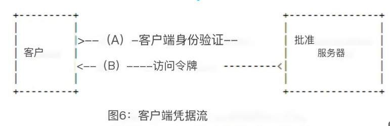
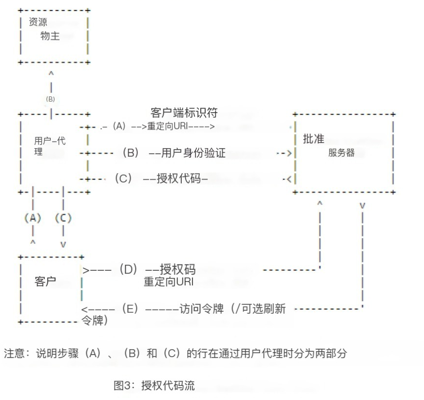
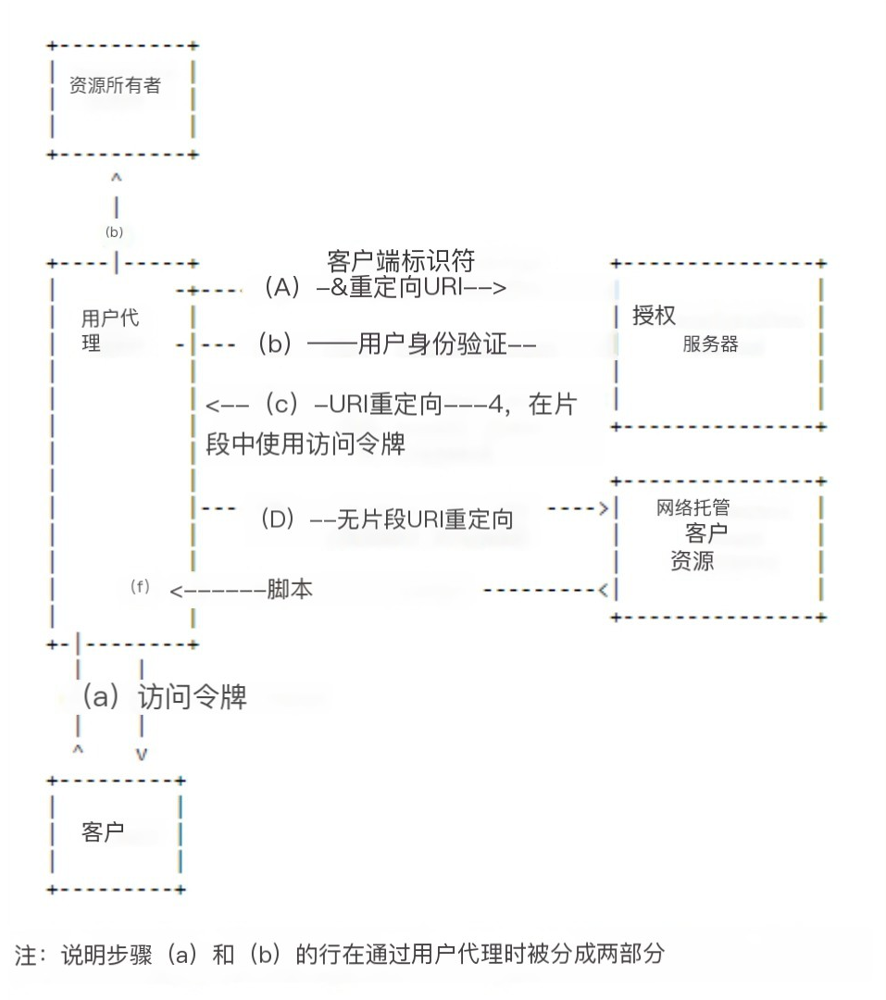

::: tip ✨✨✨✨✨
OpenIddict 是一个开源且通用的框架，用于在任何 ASP.NET Core 2.1（及更高版本）和传统的 ASP.NET 4.6.1（及更高版本）应用程序中构建符合标准的 OAuth 2.0 / OpenID Connect 服务器。
:::

<!-- more -->

## [介绍](https://documentation.openiddict.com/guides/index.html)

### 什么是 OpenIddict？

OpenIddict 是一个开源且通用的框架，用于在任何 ASP.NET Core 2.1（及更高版本）和传统的 ASP.NET 4.6.1（及更高版本）应用程序中构建符合标准的 OAuth 2.0 / OpenID Connect 服务器。

OpenIddict 诞生于2015年末，最初基于 AspNet.Security.OpenIdConnect.Server（代号 ASOS），这是一个低级别的 OpenID Connect 服务器中间件，受到 Microsoft 为 OWIN 项目开发的 OAuth 2.0 授权服务器中间件以及 ASP.NET Core 首个 OpenID Connect 服务器的启发。

2020年，ASOS 被合并到 OpenIddict 3.0 中，形成了一个统一的堆栈，在“降级模式”的帮助下仍能为新用户提供易于使用的方法和为高级用户提供低级别的体验，而不需要支持数据库。

作为这个过程的一部分，OpenIddict 3.0 添加了对 ASP.NET 4.6.1（及更高版本）的原生支持，使其成为替换 `Microsoft.OwinOAuthAuthorizationServerMiddleware` 和 `OAuthBearerAuthenticationMiddleware` 的绝佳选择，无需迁移到 ASP.NET Core。

### 核心概念

#### 用户身份验证

与其他解决方案不同，OpenIddict 专注于授权过程的 OAuth 2.0 / OpenID Connect 协议方面，并将用户身份验证交给实现者：OpenIddict 可与任何形式的用户身份验证（如密码、令牌、联合身份验证或集成 Windows 认证）原生配合使用。虽然方便，但不需要使用类似于 ASP.NET Core Identity 的成员资格堆栈。

#### 通行模式

与 `OAuthAuthorizationServerMiddleware` 类似，OpenIddict 允许在自定义控制器操作或任何其他能够钩入 ASP.NET Core 或 OWIN 请求处理管道的中间件中处理授权、注销和令牌请求。在这种情况下，OpenIddict 将始终首先验证传入请求（例如，通过确保强制参数存在且有效），然后允许调用其余的管道：如果发生任何验证错误，则 OpenIddict 会在到达用户定义的控制器操作或自定义中间件之前自动拒绝请求。

```cs
builder.Services.AddOpenIddict()
    .AddServer(options =>
    {
        // 启用授权和令牌终结点。
        options.SetAuthorizationEndpointUris("/authorize")
               .SetTokenEndpointUris("/token");

        // 启用授权代码流。
        options.AllowAuthorizationCodeFlow();

        // 注册签名和加密凭据。
        options.AddDevelopmentEncryptionCertificate()
               .AddDevelopmentSigningCertificate();

        // 注册ASP.NET Core主机并配置授权终结点
        // 允许/authorify最小API处理程序处理授权请求
        // 经过内置的OpenIddict服务器事件处理程序验证后。
        //
        // 令牌请求将由OpenIddict自己通过重用标识来处理
        // 由/authorify处理程序创建并存储在授权代码中。
        options.UseAspNetCore()
               .EnableAuthorizationEndpointPassthrough();
    });
```

```cs
app.MapGet("/authorize", async (HttpContext context) =>
{
    // 解决存储在Steam身份验证舞蹈后创建的主体中的声明。
    // 如果找不到主体，则触发一个新的挑战，将用户重定向到Steam。
    var principal = (await context.AuthenticateAsync(SteamAuthenticationDefaults.AuthenticationScheme))?.Principal;
    if (principal is null)
    {
        return Results.Challenge(properties: null, new[] { SteamAuthenticationDefaults.AuthenticationScheme });
    }

    var identifier = principal.FindFirst(ClaimTypes.NameIdentifier)!.Value;

    // 创建一个新身份并从Steam主体导入一些精选声明。
    var identity = new ClaimsIdentity(TokenValidationParameters.DefaultAuthenticationType);
    identity.AddClaim(new Claim(Claims.Subject, identifier));
    identity.AddClaim(new Claim(Claims.Name, identifier).SetDestinations(Destinations.AccessToken));

    return Results.SignIn(new ClaimsPrincipal(identity), properties: null, OpenIddictServerAspNetCoreDefaults.AuthenticationScheme);
});
```

#### 事件模式

OpenIddict 为其服务器和验证堆栈实现了一个强大的基于事件的模型：每个请求处理逻辑部分都实现为一个事件处理程序，可以将其移除、移动到管道中的不同位置或替换为自定义处理程序，以覆盖 OpenIddict 使用的默认逻辑。

```cs
/// <summary>
/// 包含负责拒绝未指定有效提示参数的授权请求的逻辑。
/// </summary>
public class ValidatePromptParameter : IOpenIddictServerHandler<ValidateAuthorizationRequestContext>
{
    /// <summary>
    /// 获取分配给此处理程序的默认描述符定义。
    /// </summary>
    public static OpenIddictServerHandlerDescriptor Descriptor { get; }
        = OpenIddictServerHandlerDescriptor.CreateBuilder<ValidateAuthorizationRequestContext>()
            .UseSingletonHandler<ValidatePromptParameter>()
            .SetOrder(ValidateNonceParameter.Descriptor.Order + 1_000)
            .SetType(OpenIddictServerHandlerType.BuiltIn)
            .Build();

    /// <inheritdoc/>
    public ValueTask HandleAsync(ValidateAuthorizationRequestContext context)
    {
        if (context is null)
        {
            throw new ArgumentNullException(nameof(context));
        }

        // 通过同意/登录或选择帐户拒绝指定prompt=none的请求。
        if (context.Request.HasPrompt(Prompts.None) && (context.Request.HasPrompt(Prompts.Consent) ||
                                                        context.Request.HasPrompt(Prompts.Login) ||
                                                        context.Request.HasPrompt(Prompts.SelectAccount)))
        {
            context.Logger.LogInformation(SR.GetResourceString(SR.ID6040));

            context.Reject(
                error: Errors.InvalidRequest,
                description: SR.FormatID2052(Parameters.Prompt),
                uri: SR.FormatID8000(SR.ID2052));

            return default;
        }

        return default;
    }
}
```

在 OpenIddict 中，事件处理程序通常定义为专用类，但也可以使用委托进行注册。

```cs
services.AddOpenIddict()
    .AddServer(options =>
    {
        options.AddEventHandler<HandleConfigurationRequestContext>(builder =>
            builder.UseInlineHandler(context =>
            {
                // 将自定义元数据附加到配置文档。
                context.Metadata["custom_metadata"] = 42;

                return default;
            }));
    });
```

## [入门指南](https://documentation.openiddict.com/guides/getting-started.html)

使用 OpenIddict 实现自定义 OpenID Connect 服务器的最简单选项是克隆 [openiddict-samples](https://github.com/openiddict/openiddict-samples) 存储库中的官方示例之一。

如果您不想从推荐的示例之一开始，您需要：

- 安装 [.NET Core 3.1（或更高版本）](https://dotnet.microsoft.com/zh-cn/download)工具。
- 有一个现有项目或创建一个新项目：在使用 Visual Studio 的默认 ASP.NET Core 模板创建新项目时，强烈建议使用单独的用户帐户身份验证，因为它会自动包括基于 Razor Pages 的默认 ASP.NET Core Identity UI。

更新 `.csproj` 文件以引用最新的包：`OpenIddict`。

```xml
<PackageReference Include="OpenIddict.AspNetCore" Version="4.2.0" />
<PackageReference Include="OpenIddict.EntityFrameworkCore" Version="4.2.0" />
```

- 在 `Startup.ConfigureServices` 中配置 OpenIddict 核心、服务器和验证服务。这是用于机器对机器场景中的客户端凭据授权的示例：

```cs
public void ConfigureServices(IServiceCollection services)
{
    services.AddControllersWithViews();

    services.AddDbContext<ApplicationDbContext>(options =>
    {
        // 将实体框架核心配置为使用Microsoft SQL Server。
        options.UseSqlServer(Configuration.GetConnectionString("DefaultConnection"));

        // 注册OpenIddict所需的实体集。
        // 注意：如果需要替换默认的OpenIddict实体，请使用泛型重载。
        options.UseOpenIddict();
    });

    services.AddOpenIddict()

        // 注册OpenIddict核心组件。
        .AddCore(options =>
        {
            // 配置OpenIddict以使用实体框架核心存储和模型。
            // 注意：调用ReplaceDefaultEntities()来替换默认实体。
            options.UseEntityFrameworkCore()
                   .UseDbContext<ApplicationDbContext>();
        })

        // 注册OpenIddict服务器组件。
        .AddServer(options =>
        {
            // 启用令牌终结点。
            options.SetTokenEndpointUris("connect/token");

            // 启用客户端凭据流。
            options.AllowClientCredentialsFlow();

            // 注册签名和加密凭据。
            options.AddDevelopmentEncryptionCertificate()
                   .AddDevelopmentSigningCertificate();

            // 注册ASP.NET Core主机并配置ASP.NET Core选项。
            options.UseAspNetCore()
                   .EnableTokenEndpointPassthrough();
        })

        // 注册OpenIddict验证组件。
        .AddValidation(options =>
        {
            // 从本地OpenIddict服务器实例导入配置。
            options.UseLocalServer();

            // 注册ASP.NET Core主机。
            options.UseAspNetCore();
        });

    // 向示例客户端注册负责数据库种子设定的工作人员。
    // 注意：在实际应用程序中，此步骤应该是设置脚本的一部分。
    services.AddHostedService<Worker>();
}
```

- 确保 ASP.NET Core 身份验证中间件在正确的位置正确注册：

```cs
public void Configure(IApplicationBuilder app)
{
    app.UseDeveloperExceptionPage();

    app.UseRouting();

    app.UseAuthentication();
    app.UseAuthorization();

    app.UseEndpoints(options =>
    {
        options.MapControllers();
        options.MapDefaultControllerRoute();
    });
}
```

- 更新您的 Entity Framework Core 上下文注册以注册 OpenIddict 实体：

```cs
services.AddDbContext<ApplicationDbContext>(options =>
{
    // 将实体框架核心配置为使用Microsoft SQL Server。
    options.UseSqlServer(Configuration.GetConnectionString("DefaultConnection"));

    // 注册OpenIddict所需的实体集。
    // 注意：如果需要替换默认的OpenIddict实体，请使用泛型重载。
    options.UseOpenIddict();
});
```

:::info
默认情况下，OpenIddict Entity Framework Core 集成使用 string 作为主键的默认类型。如果要使用其他类型，请阅读 [Entity Framework Core 集成：使用自定义主键类型](https://documentation.openiddict.com/integrations/entity-framework-core.html#use-a-custom-primary-key-type)。
:::

- 创建自己的授权控制器：实现自定义授权控制器是必须的，以允许 OpenIddict 根据您提供的标识和声明创建令牌。这是用于机器对机器场景中的客户端凭据授权的示例：

```cs
public class AuthorizationController : Controller
{
    private readonly IOpenIddictApplicationManager _applicationManager;

    public AuthorizationController(IOpenIddictApplicationManager applicationManager)
        => _applicationManager = applicationManager;

    [HttpPost("~/connect/token"), Produces("application/json")]
    public async Task<IActionResult> Exchange()
    {
        var request = HttpContext.GetOpenIddictServerRequest();
        if (!request.IsClientCredentialsGrantType())
        {
            throw new NotImplementedException("The specified grant is not implemented.");
        }

        // 注意：客户端凭据由OpenIddict自动验证：
        // 如果client_id或clientsecret无效，则不会调用此操作。

        var application = await _applicationManager.FindByClientIdAsync(request.ClientId) ??
            throw new InvalidOperationException("The application cannot be found.");

        // 创建一个新的ClaimsIdentity，其中包含
        // 将用于创建一个id_token、一个令牌或一个代码。
        var identity = new ClaimsIdentity(TokenValidationParameters.DefaultAuthenticationType, Claims.Name, Claims.Role);

        // 使用client_id作为主题标识符。
        identity.SetClaim(Claims.Subject, await _applicationManager.GetClientIdAsync(application));
        identity.SetClaim(Claims.Name, await _applicationManager.GetDisplayNameAsync(application));

        identity.SetDestinations(static claim => claim.Type switch
        {
            // 允许将“名称”声明存储在访问令牌和身份令牌中
            // 授予“profile”作用域时（通过调用principle.SSetScope（…））。
            Claims.Name when claim.Subject.HasScope(Scopes.Profile)
                => new[] { Destinations.AccessToken, Destinations.IdentityToken },

            // 否则，只将声明存储在访问令牌中。
            _ => new[] { Destinations.AccessToken }
        });

        return SignIn(new ClaimsPrincipal(identity), OpenIddictServerAspNetCoreDefaults.AuthenticationScheme);
    }
}
```

- 注册您的客户端应用程序（例如，从 IHostedService 实现）：

```cs
public class Worker : IHostedService
{
    private readonly IServiceProvider _serviceProvider;

    public Worker(IServiceProvider serviceProvider)
        => _serviceProvider = serviceProvider;

    public async Task StartAsync(CancellationToken cancellationToken)
    {
        using var scope = _serviceProvider.CreateScope();

        var context = scope.ServiceProvider.GetRequiredService<ApplicationDbContext>();
        await context.Database.EnsureCreatedAsync();

        var manager = scope.ServiceProvider.GetRequiredService<IOpenIddictApplicationManager>();

        if (await manager.FindByClientIdAsync("console") is null)
        {
            await manager.CreateAsync(new OpenIddictApplicationDescriptor
            {
                ClientId = "console",
                ClientSecret = "388D45FA-B36B-4988-BA59-B187D329C207",
                DisplayName = "My client application",
                Permissions =
                {
                    Permissions.Endpoints.Token,
                    Permissions.GrantTypes.ClientCredentials
                }
            });
        }
    }

    public Task StopAsync(CancellationToken cancellationToken) => Task.CompletedTask;
}
```

在运行应用程序之前，请确保通过运行 Add-Migration 和 Update-Database 更新数据库中的 OpenIddict 表。

## [选择正确的流程](https://documentation.openiddict.com/guides/choosing-the-right-flow.html)

OpenIddict 内置支持 [OAuth 2.0](https://datatracker.ietf.org/doc/html/rfc6749) 和 [OpenID Connect](https://openid.net/specs/openid-connect-core-1_0.html) 核心规范定义的所有标准流程：[授权码流程](https://openid.net/specs/openid-connect-core-1_0.html#CodeFlowAuth)、[隐式流程](https://openid.net/specs/openid-connect-core-1_0.html#ImplicitFlowAuth)、[混合流程](https://openid.net/specs/openid-connect-core-1_0.html#HybridFlowAuth)（基本上是前两个流程的混合）、[资源拥有者密码凭据授权](https://datatracker.ietf.org/doc/html/rfc6749#section-4.3)和[客户端凭证授权](https://datatracker.ietf.org/doc/html/rfc6749#section-4.4)。

虽然这不是针对 OpenIddict 的特定内容，但在实现自己的授权服务器时选择最佳流程是一个重要的先决条件；因此，这里简要介绍一下不同的 OAuth 2.0 / OpenID Connect 流程。

### 非交互式流程

#### 资源拥有者密码凭据授权（不建议用于新的应用程序）

受基本身份验证直接启发，资源拥有者密码凭据授权（缩写为ROPC）在概念上是最简单的OAuth 2.0流程：客户端应用程序要求用户输入其用户名/密码，使用用户凭据（根据授权服务器定义的客户端身份验证策略，可能还需要包括自己的客户端凭据）向授权服务器发送令牌请求，并获得可用于检索用户资源的访问令牌。


```js
POST /connect/token HTTP/1.1
Host: server.example.com
Content-Type: application/x-www-form-urlencoded

grant_type=password&username=johndoe&password=A3ddj3w
```

```js
HTTP/1.1 200 OK
Content-Type: application/json;charset=UTF-8
Cache-Control: no-store
Pragma: no-cache

{
  "access_token":"2YotnFZFEjr1zCsicMWpAA",
  "token_type":"bearer",
  "expires_in":3600
}
```

:::danger
此流程不被 OAuth 2.0 规范推荐，因为它是唯一一种将用户密码直接暴露给客户端应用程序的授权类型，这违反了最小特权原则，并使其不适合于无法被授权服务器完全信任的第三方客户端应用程序。

尽管这种授权方式很受欢迎且容易实现（因为它不涉及任何重定向或同意表单，并且与交互式流程不同，不需要实现跨站点请求伪造（XSRF）对策以防止会话固定攻击），但不建议在新应用程序中使用。相反，鼓励用户使用授权码流程，该流程不会将密码暴露给客户端应用程序，并且不限于密码身份验证。
:::

#### 客户端凭证授权（建议用于机器对机器通信）

客户端凭证授权与资源拥有者密码凭据授权几乎相同，只是它专门为客户端到服务器场景设计（此流程不涉及用户）：客户端应用程序发送包含其凭据的令牌请求，并获得可用于查询其自己资源的访问令牌。



```js
POST /connect/token HTTP/1.1
Host: server.example.com
Content-Type: application/x-www-form-urlencoded

grant_type=client_credentials&client_id=s6BhdRkqt3&client_secret=gX1fBat3bV
```

```js
HTTP/1.1 200 OK
Content-Type: application/json;charset=UTF-8
Cache-Control: no-store
Pragma: no-cache

{
  "access_token":"2YotnFZFEjr1zCsicMWpAA",
  "token_type":"bearer",
  "expires_in":3600
}
```

:::info
与资源拥有者密码凭据授权不同，当使用客户端凭证授权时，客户端身份验证不是可选的，OpenIddict 将始终拒绝未经身份验证的令牌请求，[这是 OAuth 2.0 规范所要求的](https://tools.ietf.org/html/rfc6749#section-4.4.2)。

这意味着您不能将客户端凭证授权用于像浏览器、移动应用程序或桌面应用程序这样的公共应用程序，因为它们无法保持其凭据的机密性。
:::

### 交互式流程

#### 授权码流程（建议用于新应用程序）

虽然授权码流程可能是最复杂的流程（因为它涉及到用户代理重定向和反向通信），但对于涉及终端用户的任何场景，无论他们是使用密码、PIN、智能卡甚至外部提供者登录，都建议使用该流程。作为回报，当在服务器端应用程序中使用此流程时，该流程具有很大优势：无法通过用户代理拦截访问令牌。

授权码流程基本上有两个步骤：授权请求/响应 和 令牌请求/响应。



- **步骤1：授权请求**

在此流程中，客户端应用程序始终通过生成包括必填参数、其 response_type=code、其 client_id、其 redirect_uri 以及可选地包括一个 scope 和一个参数以[允许传递自定义数据并帮助减轻 XSRF 攻击](https://openid.net/specs/openid-connect-core-1_0.html#AuthRequest)的 state 的授权请求来启动身份验证过程。

:::info
在大多数情况下，客户端应用程序将只返回一个带有头部的 302 响应以重定向用户代理到授权终结点，但根据您正在使用的 OpenID Connect 客户端，可能还支持 POST 请求以允许您发送大型授权请求。通常，此功能是使用自动提交的 HTML 表单实现的。
:::

```js
HTTP/1.1 302 Found
Location: https://server.example.com/authorize?response_type=code&client_id=s6BhdRkqt3&state=af0ifjsldkj&redirect_uri=https%3A%2F%2Fclient.example.org%2Fcb
```

```js
GET /connect/authorize?response_type=code&client_id=s6BhdRkqt3&state=af0ifjsldkj&redirect_uri=https%3A%2F%2Fclient.example.org%2Fcb HTTP/1.1
Host: server.example.com
```

身份提供者处理授权请求的方式因实现而异，但在大多数情况下，会显示一个同意表单询问用户是否同意与客户端应用程序共享他/她的个人数据。


当授权被给予时，用户代理将被重定向回客户端应用程序，并返回一个名为授权码的唯一且生命周期短暂的令牌，客户端将能够通过发送令牌请求来交换它以获取访问令牌。

```js
HTTP/1.1 302 Found
Location: https://client.example.org/cb?code=SplxlOBeZQQYbYS6WxSbIA&state=af0ifjsldkj
```

:::warning
为了防止 XSRF/会话固定攻击，客户端应用程序必须确保身份提供者返回的 state 参数与原始状态相对应，并在两个值不匹配时停止处理授权响应。[通常，这是通过生成不可猜测的字符串和相应的相关 cookie 来完成的](https://datatracker.ietf.org/doc/html/rfc6749#section-10.12)。
:::

- **步骤2：令牌请求**

当客户端应用程序收到授权码后，必须立即通过发送令牌请求来兑换它以获取访问令牌。`grant_type=authorization_code`

:::info
为了帮助身份提供者[减轻伪造客户端攻击](https://datatracker.ietf.org/doc/html/rfc6819#section-4.4.1.7)，还必须发送原始 `redirect_uri`。
如果客户端应用程序是保密应用程序（即已分配客户端凭据的应用程序），则需要进行身份验证。
:::

```js
POST /connect/token HTTP/1.1
Host: server.example.com
Content-Type: application/x-www-form-urlencoded

grant_type=authorization_code&code=SplxlOBeZQQYbYS6WxSbIA&redirect_uri=https%3A%2F%2Fclient%2Eexample%2Ecom%2Fcb&client_id=s6BhdRkqt3&client_secret=gX1fBat3bV&scope=openid
```

```js
HTTP/1.1 200 OK
Content-Type: application/json;charset=UTF-8
Cache-Control: no-store
Pragma: no-cache

{
  "access_token":"2YotnFZFEjr1zCsicMWpAA",
  "token_type":"bearer",
  "expires_in":3600
}
```

:::info
为了增加安全性，可以指定其他参数，例如 code_challenge 和 code_challenge_method，以将授权终结点返回的授权码绑定到原始授权请求。这种机制称为 [Proof Key for Code Exchange](https://documentation.openiddict.com/configuration/proof-key-for-code-exchange.html)，OpenIddict 完全支持它。
:::

#### 隐式流程（不建议用于新应用程序）

隐式流程类似于授权码流程，但没有令牌请求/响应步骤：访问令牌直接作为授权响应的 URI 片段（或在使用 response_mode=form_post 时作为请求表单的一部分）返回给客户端应用程序。



```js
GET /connect/authorize?response_type=token&client_id=s6BhdRkqt3&redirect_uri=https%3A%2F%2Fclient.example.org%2Fcb&scope=openid&state=af0ifjsldkj&nonce=n-0S6_WzA2Mj HTTP/1.1
Host: server.example.com
```

```js
HTTP/1.1 302 Found
Location: https://client.example.org/cb#access_token=SlAV32hkKG&token_type=bearer&expires_in=3600&state=af0ifjsldkj
```

:::danger
隐式流程最初是为浏览器应用程序设计的，它本质上比授权码流程不太安全，并且不支持 [Proof Key for Code Exchange](https://datatracker.ietf.org/doc/html/rfc7636)。因此，在新应用程序中使用它是不推荐的。
:::

:::warning
为了防止 XSRF/会话固定攻击，客户端应用程序必须确保身份提供者返回的 state 参数与原始状态相对应，并在两个值不匹配时停止处理授权响应。[通常，这是通过生成不可猜测的字符串和相应的值存储在本地存储中来完成的](https://datatracker.ietf.org/doc/html/rfc6749#section-10.12)。

当使用隐式流程时，客户端应用程序还必须确保访问令牌没有发给另一个应用程序，以防止[混淆委托攻击](https://stackoverflow.com/questions/17241771/how-and-why-is-google-oauth-token-validation-performed/17439317#17439317)。使用 OpenID Connect 时，可以通过使用并检查 JWT 身份令牌的声明来完成此操作，该声明必须对应或包含客户端应用程序的 aud（受众）声明。 `response_type=id_token token&aud&client_id`。
:::

## [配置](https://documentation.openiddict.com/configuration/index.html)

### 介绍

OpenIddict 3.0 提供了合理的默认值，但是根据情况，可以修改默认设置以更改 OpenIddict 对请求的响应方式。

### 应用程序权限

OpenIddict 包含一个内置功能，称为“应用程序权限”，允许控制和限制每个注册的客户端应用程序能够使用的 OAuth 2.0/OpenID Connect 功能。

当前支持 4 种权限类别：

- 端点权限。
- 授予类型权限。
- 范围权限。
- 响应类型权限（在 OpenIddict 3.0 中引入）。

#### 端点权限

##### 定义

端点权限限制客户端应用程序可以使用的端点。

##### 支持的权限

| 端点                              | 常量                                                    |
| --------------------------------- | ------------------------------------------------------- |
| Authorization(授权)               | OpenIddictConstants.Permissions.Endpoints.Authorization |
| Introspection(验证)               | OpenIddictConstants.Permissions.Endpoints.Introspection |
| Logout/end session(注销/结束会话) | OpenIddictConstants.Permissions.Endpoints.Logout        |
| Revocation(撤销)                  | OpenIddictConstants.Permissions.Endpoints.Revocation    |
| Token(令牌)                       | OpenIddictConstants.Permissions.Endpoints.Token         |

##### 示例

在下面的示例中，允许应用程序使用授权、注销和令牌端点，但在尝试发送验证或撤销请求时会出错：`mvc`

```cs
if (await manager.FindByClientIdAsync("mvc") is null)
{
    await manager.CreateAsync(new OpenIddictApplicationDescriptor
    {
        ClientId = "mvc",
        ClientSecret = "901564A5-E7FE-42CB-B10D-61EF6A8F3654",
        DisplayName = "MVC client application",
        PostLogoutRedirectUris = { new Uri("http://localhost:53507/signout-callback-oidc") },
        RedirectUris = { new Uri("http://localhost:53507/signin-oidc") },
        Permissions =
        {
            OpenIddictConstants.Permissions.Endpoints.Authorization,
            OpenIddictConstants.Permissions.Endpoints.Logout,
            OpenIddictConstants.Permissions.Endpoints.Token
        }
    });
}
```

##### 禁用端点权限

如果您不想使用端点权限，请调用 `options.IgnoreEndpointPermissions()` 来忽略它们。

```cs
services.AddOpenIddict()
    .AddServer(options =>
    {
        options.IgnoreEndpointPermissions();
    });
```

#### 授权类型权限

##### 定义

授权类型权限限制客户端应用程序可以使用的授权类型。

##### 支持的权限

| 授权类型                       | 常量                                                         |
| ------------------------------ | ------------------------------------------------------------ |
| Authorization code(授权码)     | OpenIddictConstants.Permissions.GrantTypes.AuthorizationCode |
| Client credentials(客户端凭据) | OpenIddictConstants.Permissions.GrantTypes.ClientCredentials |
| Implicit(隐式授权)             | OpenIddictConstants.Permissions.GrantTypes.Implicit          |
| Password(密码授权)             | OpenIddictConstants.Permissions.GrantTypes.Password          |
| Refresh token(刷新令牌)        | OpenIddictConstants.Permissions.GrantTypes.RefreshToken      |

要添加自定义授权类型权限，可以使用以下模式：

```cs
OpenIddictConstants.Permissions.Prefixes.GrantType + "custom_flow_name"
```

##### 示例

在下面的示例中，应用程序只能使用授权码授权，而密码授权和刷新令牌授权受到限制：`postman`, `console`, `password`, `refresh_token`

```cs
if (await manager.FindByClientIdAsync("postman") is null)
{
    await manager.CreateAsync(new OpenIddictApplicationDescriptor
    {
        ClientId = "postman",
        DisplayName = "Postman",
        RedirectUris = { new Uri("https://www.getpostman.com/oauth2/callback") },
        Permissions =
        {
            OpenIddictConstants.Permissions.Endpoints.Authorization,
            OpenIddictConstants.Permissions.Endpoints.Token,

            OpenIddictConstants.Permissions.GrantTypes.AuthorizationCode
        }
    });
}

if (await manager.FindByClientIdAsync("console") is null)
{
    await manager.CreateAsync(new OpenIddictApplicationDescriptor
    {
        ClientId = "console",
        DisplayName = "Console",
        Permissions =
        {
            OpenIddictConstants.Permissions.Endpoints.Token,

            OpenIddictConstants.Permissions.GrantTypes.Password,
            OpenIddictConstants.Permissions.GrantTypes.RefreshToken
        }
    });
}
```

##### 禁用授权类型权限

如果您不想使用授权类型权限，请调用 `options.IgnoreGrantTypePermissions()` 来忽略它们。

```cs
services.AddOpenIddict()
    .AddServer(options =>
    {
        options.IgnoreGrantTypePermissions();
    });
```

#### 范围权限

##### 定义

范围权限限制客户端应用程序可以使用的范围（标准或自定义）。

:::info
`openid` 和 `offline_access` 范围由 OpenIddict 特殊处理，不需要显式授权。
:::

##### 支持的权限

| 范围              | 常量                                           |
| ----------------- | ---------------------------------------------- |
| address(地址)     | OpenIddictConstants.Permissions.Scopes.Address |
| email(电子邮件)   | OpenIddictConstants.Permissions.Scopes.Email   |
| phone(电话)       | OpenIddictConstants.Permissions.Scopes.Phone   |
| profile(个人资料) | OpenIddictConstants.Permissions.Scopes.Profile |
| roles(角色)       | OpenIddictConstants.Permissions.Scopes.Roles   |

要添加自定义范围权限，可以使用以下模式：

```cs
OpenIddictConstants.Permissions.Prefixes.Scope + "custom_scope_name"
```

##### 示例

在下面的示例中，客户端允许请求 `openid`、`address`、`profile` 和 `marketing_api` 范围，而请求其他范围将导致返回错误：`angular`, `address`, `profile`, `marketing_api`

```cs
if (await manager.FindByClientIdAsync("angular") is null)
{
    await manager.CreateAsync(new OpenIddictApplicationDescriptor
    {
        ClientId = "angular",
        DisplayName = "Angular",
        RedirectUris = { new Uri("https://localhost:34422/callback") },
        Permissions =
        {
            OpenIddictConstants.Permissions.Endpoints.Authorization,
            OpenIddictConstants.Permissions.GrantTypes.Implicit,

            OpenIddictConstants.Permissions.Scopes.Address,
            OpenIddictConstants.Permissions.Scopes.Profile,
            OpenIddictConstants.Permissions.Prefixes.Scope + "marketing_api"
        }
    });
}
```

##### 禁用范围权限

如果您不想使用范围权限，请调用 `options.IgnoreScopePermissions()` 来忽略它们。

#### 响应类型权限

:::info
响应类型权限是在 OpenIddict 3.0 中引入的。
:::

##### 定义

响应类型权限限制客户端应用程序在实现诸如授权码、隐式或混合等交互式流程时可以使用的响应类型。

##### 支持的权限

| 响应类型            | 常量                                                           |
| ------------------- | -------------------------------------------------------------- |
| code                | OpenIddictConstants.Permissions.ResponseTypes.Code             |
| code Id_Token       | OpenIddictConstants.Permissions.ResponseTypes.CodeIdToken      |
| code Id_Token Token | OpenIddictConstants.Permissions.ResponseTypes.CodeIdTokenToken |
| code Token          | OpenIddictConstants.Permissions.ResponseTypes.CodeToken        |
| id_token            | OpenIddictConstants.Permissions.ResponseTypes.IdToken          |
| id_token Token      | OpenIddictConstants.Permissions.ResponseTypes.IdTokenToken     |
| none                | OpenIddictConstants.Permissions.ResponseTypes.None             |
| token               | OpenIddictConstants.Permissions.ResponseTypes.Token            |

##### 示例

在下面的示例中，应用程序只能使用响应类型 `postman`, `code id_token`

```cs
if (await manager.FindByClientIdAsync("postman") is null)
{
    await manager.CreateAsync(new OpenIddictApplicationDescriptor
    {
        ClientId = "postman",
        DisplayName = "Postman",
        RedirectUris = { new Uri("https://www.getpostman.com/oauth2/callback") },
        Permissions =
        {
            OpenIddictConstants.Permissions.Endpoints.Authorization,
            OpenIddictConstants.Permissions.Endpoints.Token,

            OpenIddictConstants.Permissions.GrantTypes.AuthorizationCode,

            OpenIddictConstants.Permissions.ResponseTypes.CodeIdToken
        }
    });
}
```

##### 禁用响应类型权限

如果您不想使用响应类型权限，请调用 `options.IgnoreResponseTypePermissions()` 来忽略它们。

```cs
services.AddOpenIddict()
    .AddServer(options =>
    {
        options.IgnoreResponseTypePermissions();
    });
```

### 授权存储

为了跟踪令牌和用户同意的逻辑链路，OpenIddict 支持在数据库中存储授权（有些 OpenID Connect 实现中也称之为“grants(授权)”）。

#### 授权类型

授权可以是两种类型：永久性和即席性。

##### 永久性授权

永久性授权是使用 API 创建的开发人员定义的授权，并使用 OpenIddict 特定的扩展方法显式附加到 `IOpenIddictAuthorizationManager.CreateAsync()` 和 `ClaimsPrincipalprincipal.SetAuthorizationId()` 上。

此类授权通常用于记住用户同意并避免为每个授权请求显示同意视图。为此，可以为每个应用程序定义一个“同意类型”，如下例所示：

```cs
// 从数据库中检索应用程序详细信息。
var application = await _applicationManager.FindByClientIdAsync(request.ClientId) ??
    throw new InvalidOperationException("The application cannot be found.");

// 检索与用户和应用程序关联的永久授权。
var authorizations = await _authorizationManager.FindAsync(
    subject: await _userManager.GetUserIdAsync(user), // 获取用户ID
    client : await _applicationManager.GetIdAsync(application), // 获取应用程序ID
    status : Statuses.Valid, // 授权状态：有效
    type   : AuthorizationTypes.Permanent, // 授权类型：永久
    scopes : request.GetScopes()) // 获取请求的作用域
    .ToListAsync(); // 转换为List

switch (await _applicationManager.GetConsentTypeAsync(application)) // 获取同意类型
{
    // 如果同意是外部的（例如，当系统管理员授予授权时），
    // 如果在数据库中找不到授权，则立即返回错误。
    case ConsentTypes.External when !authorizations.Any(): // 当同意类型为External且没有找到授权时
        return Forbid(
            authenticationSchemes: OpenIddictServerAspNetCoreDefaults.AuthenticationScheme,
            properties: new AuthenticationProperties(new Dictionary<string, string>
            {
                [OpenIddictServerAspNetCoreConstants.Properties.Error] = Errors.ConsentRequired, // 错误类型：ConsentRequired
                [OpenIddictServerAspNetCoreConstants.Properties.ErrorDescription] =
                "The logged in user is not allowed to access this client application." // 错误描述
            }));

    // 如果同意是隐含的或者如果发现授权，
    // 在不显示同意书的情况下返回授权响应。
    case ConsentTypes.Implicit: // 当同意类型为Implicit时
    case ConsentTypes.External when authorizations.Any(): // 当同意类型为External且找到授权时
    case ConsentTypes.Explicit when authorizations.Any() && !request.HasPrompt(Prompts.Consent): // 当同意类型为Explicit，有授权，并且请求不要求明确同意时
        // 创建OpenIddict将用于生成令牌的基于声明的标识。
        var identity = new ClaimsIdentity(
            authenticationType: TokenValidationParameters.DefaultAuthenticationType, // 认证类型
            nameType: Claims.Name, // 名称类型
            roleType: Claims.Role); // 角色类型

        // 添加将在令牌中持久化的声明。
        identity.SetClaim(Claims.Subject, await _userManager.GetUserIdAsync(user)) // 用户主题ID
                .SetClaim(Claims.Email, await _userManager.GetEmailAsync(user)) // 用户电子邮件
                .SetClaim(Claims.Name, await _userManager.GetUserNameAsync(user)) // 用户名称
                .SetClaims(Claims.Role, (await _userManager.GetRolesAsync(user)).ToImmutableArray()); // 用户角色

        // 注意：在此示例中，授予的作用域与请求的作用域匹配
        // 但是您可能希望允许用户取消选中特定的作用域。
        // 为此，只需在调用SetScope之前限制作用域列表即可。
        identity.SetScopes(request.GetScopes()); // 设置标识的作用域
        identity.SetResources(await _scopeManager.ListResourcesAsync(identity.GetScopes()).ToListAsync()); // 设置标识关联的资源

        // 自动创建永久授权以避免需要明确同意
        // 用于将来包含相同作用域的授权或令牌请求。
        var authorization = authorizations.LastOrDefault(); // 获取最近的授权，如果没有则为null
        authorization ??= await _authorizationManager.CreateAsync(
            identity: identity,
            subject : await _userManager.GetUserIdAsync(user), // 授权主题：用户ID
            client  : await _applicationManager.GetIdAsync(application), // 授权客户端：应用程序ID
            type    : AuthorizationTypes.Permanent, // 授权类型：永久
            scopes  : identity.GetScopes()); // 授权作用域：标识的作用域

        identity.SetAuthorizationId(await _authorizationManager.GetIdAsync(authorization)); // 设置标识关联的授权ID

        identity.SetDestinations(static claim => claim.Type switch // 设置标识关联的目的地
        {
            // 如果授予了“概要文件”范围，则允许“名称”声明
            // 添加到从主体派生的访问令牌和身份令牌中。
            Claims.Name when claim.Subject.HasScope(Scopes.Profile) => new[]
            {
                OpenIddictConstants.Destinations.AccessToken,
                OpenIddictConstants.Destinations.IdentityToken
            },

            // 永远不要将“secret_value”声明添加到访问或身份令牌中。
            // 在这种情况下，它将仅被添加到授权代码中，
            // 刷新令牌和用户/设备代码，它们总是被加密的。
            "secret_value" => Array.Empty<string>(),

            // 否则，只将声明添加到访问令牌中。
            _ => new[]
            {
                OpenIddictConstants.Destinations.AccessToken
            }
        });

        return SignIn(new ClaimsPrincipal(identity), OpenIddictServerAspNetCoreDefaults.AuthenticationScheme); // 返回包含标识的登录响应

    // 此时，在数据库中未找到授权，必须返回错误
    // 如果客户端应用程序在授权请求中指定了prompt＝none。
    case ConsentTypes.Explicit   when request.HasPrompt(Prompts.None): // 当同意类型为Explicit且请求指定了prompt=none时
    case ConsentTypes.Systematic when request.HasPrompt(Prompts.None): // 当同意类型为Systematic且请求指定了prompt=none时
        return Forbid(
            authenticationSchemes: OpenIddictServerAspNetCoreDefaults.AuthenticationScheme,
            properties: new AuthenticationProperties(new Dictionary<string, string>
            {
                [OpenIddictServerAspNetCoreConstants.Properties.Error] = Errors.ConsentRequired, // 错误类型：ConsentRequired
                [OpenIddictServerAspNetCoreConstants.Properties.ErrorDescription] =
                    "Interactive user consent is required." // 错误描述
            }));

    // 在其他情况下，提交同意书。
    default: return View(new AuthorizeViewModel // 显示授权视图
    {
        ApplicationName = await _applicationManager.GetLocalizedDisplayNameAsync(application), // 获取应用程序显示名称
        Scope = request.Scope // 获取请求的作用域
    });
}
```

##### 临时授权

当出于安全原因需要跟踪令牌链，但开发人员没有将显式的永久性授权附加到用于登录操作的 ClaimsPrincipal 时，OpenIddict 会自动创建临时授权。

此类授权通常在授权码流程中创建，以连接与原始授权代码关联的所有令牌，以便在授权代码被多次兑换（这可能表示令牌泄漏）时可以自动撤销它们。同样，当使用资源所有者密码凭据授权请求返回刷新令牌时，也会创建临时授权。

:::info
使用 [OpenIddict.Quartz](https://www.nuget.org/packages/OpenIddict.Quartz/) 集成时，临时授权将在短时间内（默认为14天）自动从数据库中删除。与临时授权不同，永久性授权永远不会从数据库中删除。
:::

#### 在 API 级别启用授权条目验证

出于性能考虑，默认情况下，当收到 API 请求时，OpenIddict 3.0 不会检查授权条目的状态：即使附加的授权已被撤销，访问令牌也被视为有效。对于需要立即撤销授权的场景，可以配置 OpenIddict 验证处理程序以强制执行每个 API 请求的授权条目验证：

:::info
启用授权条目验证要求 OpenIddict 验证处理程序能够直接访问服务器数据库，其中包含授权。这使得它更适用于位于授权服务器相同应用程序中的 API。对于外部应用程序，请考虑使用内省而不是本地验证。

在两种情况下，都需要额外的延迟——由于额外的 DB 请求和内省的 HTTP 调用而引起。
:::

```cs
services.AddOpenIddict()
    .AddValidation(options =>
    {
        options.EnableAuthorizationEntryValidation();
    });
```

#### 禁用授权存储

虽然强烈不建议这样做，但可以在服务器选项中禁用授权存储：

```cs
services.AddOpenIddict()
    .AddServer(options =>
    {
        options.DisableAuthorizationStorage();
    });
```

### 声明目标

在生成授权码、刷新令牌和设备/用户代码时，OpenIddict 会自动将指定登录操作期间的所有声明复制到生成的代码/令牌中。这是安全的操作，因为这些令牌始终加密，并且除了 OpenIddict 本身之外，没有人可以读取它们（用户或请求它们的客户端应用程序无法读取其内容）。

对于访问令牌和身份令牌，则有所不同，因为这些令牌旨在由不同的方使用：

- 客户端应用程序完全可以访问包含在其接收到的身份令牌中的声明。
- 预期资源服务器可以读取用于 API 调用中的访问令牌中包含的声明。
- 对于桌面、移动或基于浏览器的应用程序，通常很容易让用户访问身份令牌（例如，通过使用 Fiddler 拦截 HTTP 响应、使用开发工具或转储客户端进程的内存）。
- 如果明确禁用了访问令牌加密，则客户端应用程序或用户本身可以访问访问令牌的内容（例如，通过复制令牌有效负载并使用像 [https：//jwt.io/](https：//jwt.io/) 这样的工具）。

出于这些原因，OpenIddict 不会自动将附加到 ClaimsPrincipal 的声明复制到访问或身份令牌中（除了 claim，这是 OpenIddict 中唯一强制性的声明）。为了允许 OpenIddict 将特定声明持久化到访问或身份令牌中，必须向每个要公开的实例添加称为“声明目标”的标志。

:::info
要附加一个或多个目标到一个声明，请使用在 . 中定义的扩展。在典型情况下，授予的范围可以用于确定允许将哪些声明复制到访问和身份令牌中，如下面的示例所示：`principal.SetDestinations()`,`OpenIddict.Abstractions`
:::

```cs
var principal = await _signInManager.CreateUserPrincipalAsync(user);

// 注意：在此示例中，授予的作用域与请求的作用域匹配
// 但是您可能希望允许用户取消选中特定的作用域。
// 为此，只需在调用SetScope（）之前限制作用域列表即可。
principal.SetScopes(request.GetScopes());
principal.SetResources(await _scopeManager.ListResourcesAsync(principal.GetScopes()).ToListAsync());
principal.SetDestinations(static claim => claim.Type switch
{
    // 如果授予了“概要文件”范围，则允许“名称”声明
    // 添加到从主体派生的访问令牌和身份令牌中。
    Claims.Name when claim.Subject.HasScope(Scopes.Profile) => new[]
    {
        OpenIddictConstants.Destinations.AccessToken,
        OpenIddictConstants.Destinations.IdentityToken
    },

    // 永远不要将“secret_value”声明添加到访问或身份令牌中。
    // 在这种情况下，它将仅被添加到授权代码中，
    // 刷新令牌和用户/设备代码，它们总是被加密的。
    "secret_value" => Array.Empty<string>(),

    // 否则，只将声明添加到访问令牌中。
    _ => new[]
    {
        OpenIddictConstants.Destinations.AccessToken
    }
});

return SignIn(principal, OpenIddictServerAspNetCoreDefaults.AuthenticationScheme);
```

### 加密和签名凭据

为了保护其发行的令牌，OpenIddict 使用两种类型的凭据：

- 签名凭据用于防止篡改。它们可以是非对称的（例如 RSA 或 ECDSA 密钥）或对称的。
- 加密凭据用于确保令牌内容无法被恶意方读取。它们可以是非对称的（例如 RSA 密钥）或对称的。

:::info
使用选择加入的 ASP.NET Core 数据保护集成生成的令牌依赖于其自己的密钥环，与本文档中讨论的凭据不同。

有关数据保护的更多信息，请访问 [ASP.NET Core 数据保护](https://learn.microsoft.com/en-us/aspnet/core/security/data-protection/introduction?view=aspnetcore-7.0)。
:::

#### 在授权服务器选项中注册凭据

OpenIddict 允许注册一个或多个键（原始键或嵌入 X.509 证书中的键）。

当注册多个键/证书时（这可能有助于实现密钥轮换），OpenIddict 根据以下算法选择最合适的键：

:::info
首先始终选择对称键，除了只能使用非对称键签名的身份令牌。
嵌入 X.509 证书的非对称键根据 NotAfter 和 NotBefore 日期进行排序（未生效的证书不会被 OpenIddict 使用，并且到期日期最远的证书始终优先使用）。
X.509 证书总是优先于原始 RSA/ECDSA 键。
:::

##### 注册临时密钥

为了开发目的，可以使用一种临时密钥（不持久化或跨实例共享），用于签署或加密令牌：

```cs
services.AddOpenIddict()
    .AddServer(options =>
    {
        options.AddEphemeralEncryptionKey()
               .AddEphemeralSigningKey();
    });
```

:::info
options.AddEphemeralEncryptionKey() 生成非对称 RSA 密钥，该密钥不直接用于加密令牌，而是用于使用 [AES](https://datatracker.ietf.org/doc/html/rfc7518#section-5.2.6) 加密令牌内容的每个令牌对称密钥的加密。

有关此机制的更多信息，请参阅[使用 RSAES OAEP 进行密钥加密](https://datatracker.ietf.org/doc/html/rfc7518#section-4.3)。
:::

##### 注册开发证书

为了开发目的，可以由 OpenIddict 生成并存储证书在运行 OpenIddict 服务器功能的用户帐户的证书存储区中。与临时密钥不同，开发证书是持久的（但不跨实例共享），并且在重新启动应用程序主机时将被重复使用。

```cs
services.AddOpenIddict()
    .AddServer(options =>
    {
        options.AddDevelopmentEncryptionCertificate()
               .AddDevelopmentSigningCertificate();
    });
```

:::warning
此功能在 .NET Framework 4.6.1 上不可用：调用 `options.AddDevelopmentEncryptionCertificate()` 或 `options.AddDevelopmentSigningCertificate()` 将在运行时引发 `PlatformNotSupportedException`，如果找不到有效的开发证书并且必须生成一个新证书，则会抛出异常。
:::

:::danger
无法在部署在 IIS 或 Azure App Service 上的应用程序中使用它们：尝试在 IIS 或 Azure App Service 上使用它们将在运行时引发异常（除非应用程序池配置为加载用户配置文件）。为避免这种情况，请考虑创建自签名证书并将其存储在主机机器的 X.509 证书存储区中。
:::

##### 注册密钥

要注册签名或加密密钥，可以提供 - 通常是 `SecurityKeySymmetricSecurityKeyRsaSecurityKey` 的实例 - 给 `options.AddSigningKey()` / `options.AddEncryptionKey()` 方法：

```cs
services.AddOpenIddict()
    .AddServer(options =>
    {
        options.AddEncryptionKey(new SymmetricSecurityKey(
            Convert.FromBase64String("DRjd/GnduI3Efzen9V9BvbNUfc/VKgXltV7Kbk9sMkY=")));
    });
```

:::info
虽然签名密钥可以是对称的或非对称的，但 OpenIddict 要求注册至少一个非对称密钥以签署身份令牌。如果注册了非对称和对称签名密钥，则在保护访问令牌、授权码或刷新令牌时始终优先选择对称密钥，而在签署旨在公开验证的身份令牌时使用非对称密钥。
:::

##### 注册证书（建议用于生产准备环境）

要注册签名或加密证书，可以使用 `X509Certificate2` 的实例调用 `options.AddSigningCertificate()` / `options.AddEncryptionCertificate()` 方法。另外，也可以提供唯一标识操作系统机器或用户证书存储区中证书的指纹。

在生产环境中，建议使用两个 RSA 证书，与用于 HTTPS 的证书不同：一个用于加密，一个用于签名。可以使用 .NET Core API 在本地生成和自签名证书：`CertificateRequest`

```cs
using var algorithm = RSA.Create(keySizeInBits: 2048);

var subject = new X500DistinguishedName("CN=Fabrikam Encryption Certificate");
var request = new CertificateRequest(subject, algorithm, HashAlgorithmName.SHA256, RSASignaturePadding.Pkcs1);
request.CertificateExtensions.Add(new X509KeyUsageExtension(X509KeyUsageFlags.KeyEncipherment, critical: true));

var certificate = request.CreateSelfSigned(DateTimeOffset.UtcNow, DateTimeOffset.UtcNow.AddYears(2));

File.WriteAllBytes("encryption-certificate.pfx", certificate.Export(X509ContentType.Pfx, string.Empty));
```

```cs
using var algorithm = RSA.Create(keySizeInBits: 2048);

var subject = new X500DistinguishedName("CN=Fabrikam Signing Certificate");
var request = new CertificateRequest(subject, algorithm, HashAlgorithmName.SHA256, RSASignaturePadding.Pkcs1);
request.CertificateExtensions.Add(new X509KeyUsageExtension(X509KeyUsageFlags.DigitalSignature, critical: true));

var certificate = request.CreateSelfSigned(DateTimeOffset.UtcNow, DateTimeOffset.UtcNow.AddYears(2));

File.WriteAllBytes("signing-certificate.pfx", certificate.Export(X509ContentType.Pfx, string.Empty));
```

最佳的证书存储位置取决于您的托管环境：

- 对于 IIS 应用程序，[将证书存储在机器存储区中](https://www.sonicwall.com/support/knowledge-base/how-can-i-import-certificates-into-the-ms-windows-local-machine-certificate-store/170504615105398/)是推荐的选项。
- 在 Azure 上，可以使用特殊标志上传和公开证书以供 Azure App Service 应用程序使用。有关更多信息，请访问 [在 Azure App Service 中的代码中使用 TLS/SSL 证书](https://www.sonicwall.com/support/knowledge-base/how-can-i-import-certificates-into-the-ms-windows-local-machine-certificate-store/170504615105398/) 页面。

#### 在API/资源验证选项中导入凭据。

##### 使用集成选项 options.UseLocalServer()

当 API 和授权服务器属于同一项目时，可以通过调用 `options.UseLocalServer()` 轻松导入签名和加密凭据

```cs
services.AddOpenIddict()
    .AddValidation(options =>
    {
        options.UseLocalServer();
    });
```

##### 使用 OpenID Connect 常规发现（仅限非对称签名密钥）

当 API 和授权服务器托管在不同的应用程序中时，可以[使用标准 OpenID Connect](https://openid.net/specs/openid-connect-discovery-1_0.html) 发现来自动导入非对称签名密钥：

```cs
services.AddOpenIddict()
    .AddValidation(options =>
    {
        options.SetIssuer("https://localhost:44319/");
        options.UseSystemNetHttp();
    });
```

##### 在令牌验证参数中注册对称签名密钥

与非对称签名密钥不同，使用基于 HMAC 的算法（如 [HS256](https://datatracker.ietf.org/doc/html/rfc7518#section-3.2)）的对称密钥不能通过 OpenID Connect 发现端点安全地公开。因此，OpenIddict 验证处理程序无法自动导入它们。对于需要使用对称签名密钥的应用程序，可以使用高级配置 API 将其注册到令牌验证选项中：

```cs
services.AddOpenIddict()
    .AddValidation(options =>
    {
        options.Configure(options => options.TokenValidationParameters.IssuerSigningKey =
            new SymmetricSecurityKey(
                Convert.FromBase64String("DRjd/GnduI3Efzen9V9BvbNUfc/VKgXltV7Kbk9sMkY=")));
    });
```

##### 注册加密密钥或证书

要导入加密密钥/证书，可以使用与 OpenIddict 服务器功能公开的相同重载：

```cs
services.AddOpenIddict()
    .AddValidation(options =>
    {
        options.AddEncryptionCertificate("b82f36609cdaff9a95de60e8d5ac774b2e496c4b");
    });
```

### 用于代码交换的验证密钥(Proof Key for Code Exchange)

最初，[Proof Key for Code Exchange（PKCE）](https://tools.ietf.org/html/rfc7636)机制被设计为一种保护移动应用程序免受恶意应用程序在同一设备上安装后看到其回调 URI 被劫持的方法。现已将此机制扩展到机密客户端，以帮助减轻授权代码泄漏。该机制被所有版本的 OpenIddict 完全支持，并可全局或按客户端进行强制执行，以阻止未发送 PKCE 参数的授权请求。

#### 在全局级别启用 PKCE 执行

可以通过在服务器选项中调用 `options.RequireProofKeyForCodeExchange()` 来全局强制执行 Proof Key for Code Exchange。

```cs
services.AddOpenIddict()
    .AddServer(options =>
    {
        options.RequireProofKeyForCodeExchange();
    });
```

#### 按客户端启用 PKCE 强制执行

可以通过将其添加到附加到客户端的要求列表中，按客户端强制执行 Proof Key for Code Exchange。

```cs
await manager.CreateAsync(new OpenIddictApplicationDescriptor
{
    ClientId = "mvc",
    ClientSecret = "901564A5-E7FE-42CB-B10D-61EF6A8F3654",
    ConsentType = ConsentTypes.Explicit,
    PostLogoutRedirectUris =
    {
        new Uri("https://localhost:44381/signout-callback-oidc")
    },
    RedirectUris =
    {
        new Uri("https://localhost:44381/signin-oidc")
    },
    Permissions =
    {
        Permissions.Endpoints.Authorization,
        Permissions.Endpoints.Logout,
        Permissions.Endpoints.Token,
        Permissions.GrantTypes.AuthorizationCode,
        Permissions.GrantTypes.RefreshToken,
        Permissions.ResponseTypes.Code,
        Permissions.Scopes.Email,
        Permissions.Scopes.Profile,
        Permissions.Scopes.Roles,
        Permissions.Prefixes.Scope + "demo_api"
    },
    Requirements =
    {
        Requirements.Features.ProofKeyForCodeExchange
    }
});
```

#### 启用支持 code_challenge_method=plain

默认情况下，OpenIddict 仅支持 `code_challenge_method=S256`，这是最安全的代码挑战方法，并且是 PKCE 规范所要求的唯一方法。虽然不建议使用，但是可以通过将其添加到 `OpenIddictServerOptions.CodeChallengeMethods` 中来手动启用该方法：`code_challenge_method=S256`、`code_challenge_method=plain`

```cs
services.AddOpenIddict()
    .AddServer(options =>
    {
        options.Configure(options => options.CodeChallengeMethods.Add(CodeChallengeMethods.Plain));
    });
```

### 令牌格式

:::info
在 OpenIddict 3.0 中，撤销令牌的能力与令牌格式无关，并且不需要启用引用令牌：只要未在服务器选项中显式禁用令牌存储，就可以撤销常规 JWT 或 ASP.NET Core 数据保护 令牌。

有关引用令牌的更多信息，请阅读[令牌存储](#令牌存储)。
:::

#### JSON Web Token

OpenIddict 3.0 实现了 [JSON Web Token](https://datatracker.ietf.org/doc/html/rfc7519)、[JSON Web Signature](https://datatracker.ietf.org/doc/html/rfc7515) 和 [JSON Web Encryption 标准](https://datatracker.ietf.org/doc/html/rfc7516)，并依赖于由 Microsoft 开发和维护的 [Azure Active Directory IdentityModel Extensions for .NET 库](https://github.com/AzureAD/azure-activedirectory-identitymodel-extensions-for-dotnet/)，使用在服务器选项中注册的凭据生成已签名和加密的令牌。

##### JWT 令牌类型

为了防止令牌替换和混淆代理攻击，OpenIddict 3.0 使用标准 JWT 标头 typ 来传递实际的令牌类型。该机制替换了先前版本的 OpenIddict 中用于相同目的的私有声明 `token_usage`。

按照 [OAuth 2.0 访问令牌的 JSON Web Token（JWT）配置文件规范](https://datatracker.ietf.org/doc/html/rfc9068)的要求，由 OpenIddict 3.0 生成的访问令牌始终带有 “typ”: “at+jwt” 标头，而身份令牌仍然使用以保持向后兼容性。其他类型的令牌 - 仅被 OpenIddict 自己的端点接受 - 使用以 "typ": "JWT"oi_ 为前缀的私有令牌类型。

##### 禁用 JWT 访问令牌加密

默认情况下，OpenIddict 强制执行其支持的所有令牌类型的加密。出于安全原因，虽然无法为授权代码、刷新令牌和设备代码禁用此强制执行，但是当需要与第三方 API/资源服务器集成时，可以放宽对访问令牌的加密要求。如果接收访问令牌的资源服务器不完全支持 JSON Web Encryption，则还可以禁用访问令牌加密。

```cs
services.AddOpenIddict()
    .AddServer(options =>
    {
        options.DisableAccessTokenEncryption();
    });
```

#### ASP.NET Core 数据保护

OpenIddict 3.0 还可以配置为使用 [ASP.NET Core 数据保护](https://learn.microsoft.com/en-us/aspnet/core/security/data-protection/introduction?view=aspnetcore-7.0) 创建数据保护令牌，而不是 JWT 令牌。ASP.NET Core 数据保护 使用自己的密钥环来加密和保护令牌免受篡改，并支持所有类型的令牌，除了始终为 JWT 令牌的身份令牌。

与 JWT 不同，ASP.NET Core 数据保护 令牌仅支持对称加密，并依赖于由 ASP.NET 团队开发的二进制格式，而不是像 JWT 那样依赖于标准。虽然这防止了在需要互操作性的场景中使用此类令牌，但选择 ASP.NET Core 数据保护 而不是 JWT 具有以下优点：

- ASP.NET Core 数据保护 令牌不使用 JSON 表示形式，因此通常比较短。
- ASP.NET Core 数据保护 已经被设计为实现高吞吐量，因为它是 ASP.NET Core 用于身份验证 cookie、防伪令牌和会话 cookie 的本地工具。

:::warning
尽管它的名称是 ASP.NET Core 数据保护，但它并不局限于 ASP.NET Core，并且可以在任何 .NET Standard 2.0 兼容的应用程序中使用，包括使用 `Microsoft.Owin` 的旧版 ASP.NET 4.6.1（及更高版本）应用程序。

要在 OpenIddict OWIN 服务器和验证主机中启用 ASP.NET Core 数据保护 支持，需要手动引用 `OpenIddict.Server.DataProtection` 和 `OpenIddict.Validation.DataProtection` 包。
:::

##### 切换到 Data Protection 令牌

ASP.NET Core 数据保护 支持由 `OpenIddict.Server.DataProtection` 和 `OpenIddict.Validation.DataProtection` 包提供。这些包由 `OpenIddict.AspNetCore` 元包引用，因此无需显式引用。

要启用 ASP.NET Core 数据保护 支持，请在服务器选项和验证选项中调用 `options.UseDataProtection()`。

```cs
services.AddOpenIddict()
    .AddServer(options =>
    {
        options.UseDataProtection();
    })

    .AddValidation(options =>
    {
        options.UseDataProtection();
    });
```

:::info
切换到 ASP.NET Core 数据保护 令牌并不会阻止在启用 Data Protection 支持之前发行的 JWT 令牌被验证：现有的令牌仍然可以与新发行的 ASP.NET Core 数据保护 令牌一起使用，直到它们过期。当发送包含 JWT 刷新令牌的刷新令牌请求时，应用程序将收到一个 ASP.NET Core 数据保护 刷新令牌，并且之前的令牌将自动标记为已兑换。
:::

默认情况下，启用 ASP.NET Core 数据保护 支持将自动将所有类型的令牌格式从 JWT 切换到 Data Protection，除了 JWT 令牌。可以配置 OpenIddict/Data Protection 集成，以在创建新令牌时首选 JWT，这在仅针对特定令牌类型（例如授权代码和刷新令牌，但不是访问令牌）使用 ASP.NET Core 数据保护 格式时非常有用。

```cs
services.AddOpenIddict()
    .AddServer(options =>
    {
        options.UseDataProtection()
               .PreferDefaultAccessTokenFormat()
               .PreferDefaultAuthorizationCodeFormat()
               .PreferDefaultDeviceCodeFormat()
               .PreferDefaultRefreshTokenFormat()
               .PreferDefaultUserCodeFormat();
    });
```

:::warning
当授权服务器和 API/资源服务器不是同一应用程序的一部分时，必须配置 ASP.NET Core 数据保护 使用相同的应用程序名称并共享相同的密钥环，以允许 OpenIddict 验证处理程序读取由位于另一个项目中的授权服务器生成的 ASP.NET Core 数据保护 令牌。

有关更多信息，请阅读 [配置 ASP.NET Core 数据保护](https://learn.microsoft.com/en-us/aspnet/core/security/data-protection/configuration/overview?view=aspnetcore-7.0)。
:::

### 令牌存储

为了跟踪其服务器服务生成的所有令牌，OpenIddict 3.0 会为每个生成的令牌在数据库中创建一个令牌条目。令牌条目包含元数据，如令牌的主题、发放给哪个应用程序的客户端标识符或其创建和过期日期。

默认情况下，使用 Azure Active Directory IdentityModel Extensions for .NET 库生成 JWT 令牌或使用 ASP.NET Core Data Protection 生成 Data Protection 令牌时，令牌负载（token payload）通常不会存储在数据库中，除了授权码（authorization codes，生命周期短暂）、设备码和用户码（仅在设备代码流程中使用）。

这样的令牌称为引用令牌（reference tokens），它们不会直接返回给调用者：相反，它们的负载存储在数据库条目中，并返回一个加密安全的随机 256 位标识符 – 称为引用标识符（reference identifier），作为客户端应用程序与 OpenIddict 终结点或资源服务器通信时使用的“最终”令牌（如果在服务器选项中启用了引用访问令牌）。

:::info
在 OpenIddict 3.0 中，撤销令牌的能力不与令牌格式绑定，并且不需要启用引用令牌：只要在服务器选项中没有明确禁用令牌存储，就可以撤销常规 JWT 或 ASP.NET Core Data Protection 令牌。
:::

#### 启用引用访问和/或刷新令牌

对于偏好返回较短的访问和/或刷新令牌或需要处理限制以防止在网络上传输大型令牌的开发人员，可以在服务器选项中手动启用引用访问和/或刷新令牌。

:::danger
在启用引用访问和/或刷新令牌支持时，强烈建议执行以下操作之一：

- 对于访问和刷新令牌，使用 ASP.NET Core Data Protection 格式，因为它们受益于额外的安全措施，如果它们被从数据库中窃取，可以防止以原始形式发送。有关如何启用 ASP.NET Core Data Protection 的更多信息，请阅读[令牌格式](#令牌格式)。
- 启用列加密/数据静态加密，以保护令牌条目的 `Payload` 列。
  :::

```cs
services.AddOpenIddict()
    .AddServer(options =>
    {
        options.UseReferenceAccessTokens()
               .UseReferenceRefreshTokens();
    });
```

#### 启用 API 级别的令牌条目验证

出于性能考虑，OpenIddict 3.0 默认情况下不会在收到 API 请求时检查令牌条目的状态：访问令牌被视为有效，直到它们过期。对于需要立即撤销访问令牌的情况，可以配置 OpenIddict 验证处理程序以强制执行每个 API 请求的令牌条目验证：

:::info
启用令牌条目验证要求 OpenIddict 验证处理程序直接访问存储令牌的服务器数据库，这使得它更适合于位于授权服务器相同应用程序中的 API。对于外部应用程序，请考虑使用 introspection 而不是本地验证。

在两种情况下，都会产生额外的延迟 - 由于额外的 DB 请求和 introspection 的 HTTP 调用而引起。
:::

```cs
services.AddOpenIddict()
    .AddValidation(options =>
    {
        options.EnableTokenEntryValidation();
    });
```

#### 禁用令牌存储

虽然强烈不建议，但可以在服务器选项中禁用令牌存储

```cs
services.AddOpenIddict()
    .AddServer(options =>
    {
        options.DisableTokenStorage();
    });
```

:::warning
禁用令牌存储会阻止启用引用访问或刷新令牌支持，因为这需要将令牌存储在数据库中。
:::

## [集成](https://documentation.openiddict.com/integrations/entity-framework-core.html)

### Entity Framework Core 集成

#### 基本配置

要将 OpenIddict 配置为使用 Entity Framework Core 作为应用程序、授权、范围和令牌的数据库，请执行以下操作：

1. 引用 `OpenIddict.EntityFrameworkCore` 包：

```xml
<PackageReference Include="OpenIddict.EntityFrameworkCore" Version="3.1.1" />
```

2. 创建从 DbContext（或在使用 ASP.NET Core Identity 时为 IdentityDbContext）派生的数据库上下文：

```cs
public class ApplicationDbContext : DbContext
{
    public ApplicationDbContext(DbContextOptions options)
        : base(options)
    {
    }
}
```

3. 配置 OpenIddict 使用 Entity Framework Core 存储：

```cs
services.AddOpenIddict()
    .AddCore(options =>
    {
        options.UseEntityFrameworkCore()
               .UseDbContext<ApplicationDbContext>();
    });
```

4. 配置 Entity Framework Core，将 OpenIddict 实体注册到模型中：

```cs
services.AddDbContext<ApplicationDbContext>(options =>
{
    // 将实体框架核心配置为使用Microsoft SQL Server。
    options.UseSqlServer(Configuration.GetConnectionString("DefaultConnection"));

    // 注册OpenIddict所需的实体集。
    options.UseOpenIddict();
});
```

5. 使用迁移或重新创建数据库以添加 OpenIddict 实体。有关更多信息，请阅读[迁移概述](https://learn.microsoft.com/en-us/ef/core/managing-schemas/migrations/?tabs=dotnet-core-cli)。

#### 高级配置

##### 使用自定义主键类型

默认情况下，Entity Framework Core 集成使用字符串主键，该主键类型与 ASP.NET Core Identity 使用的默认键类型匹配。

如果要使用不同的键类型（例如 int、long 或 Guid）：

1. 调用泛型 `ReplaceDefaultEntities<TKey>()` 方法，强制 OpenIddict 使用指定键类型的默认实体：

```cs
services.AddOpenIddict()
    .AddCore(options =>
    {
        // 将OpenIddict配置为使用具有自定义密钥类型的默认实体。
        options.UseEntityFrameworkCore()
               .UseDbContext<ApplicationDbContext>()
               .ReplaceDefaultEntities<Guid>();
    });
```

2. 配置 Entity Framework Core，将具有选定键类型的默认实体包含在模型中：

```cs
services.AddDbContext<ApplicationDbContext>(options =>
{
    // 将实体框架核心配置为使用Microsoft SQL Server。
    options.UseSqlServer(Configuration.GetConnectionString("DefaultConnection"));

    // 注册OpenIddict所需的实体集，但使用自定义密钥类型。
    options.UseOpenIddict<Guid>();
});
```

##### 使用自定义实体

对于需要在 OpenIddict 使用的属性之外存储附加数据的应用程序，可以使用自定义实体。为此，您需要执行以下操作：

1. 创建自定义实体：

```cs
public class CustomApplication : OpenIddictEntityFrameworkCoreApplication<long, CustomAuthorization, CustomToken>
{
    public string CustomProperty { get; set; }
}

public class CustomAuthorization : OpenIddictEntityFrameworkCoreAuthorization<long, CustomApplication, CustomToken>
{
    public string CustomProperty { get; set; }
}

public class CustomScope : OpenIddictEntityFrameworkCoreScope<long>
{
    public string CustomProperty { get; set; }
}

public class CustomToken : OpenIddictEntityFrameworkCoreToken<long, CustomApplication, CustomAuthorization>
{
    public string CustomProperty { get; set; }
}
```

2. 调用泛型 `ReplaceDefaultEntities<TApplication, TAuthorization, TScope, TToken, TKey>()` 方法，强制 OpenIddict 使用自定义实体：

```cs
services.AddOpenIddict()
    .AddCore(options =>
    {
        // 配置OpenIddict以使用自定义实体。
        options.UseEntityFrameworkCore()
               .UseDbContext<ApplicationDbContext>()
               .ReplaceDefaultEntities<CustomApplication, CustomAuthorization, CustomScope, CustomToken, long>();
    });
```

3. 配置 Entity Framework Core，将自定义实体包含在模型中：

```cs
services.AddDbContext<ApplicationDbContext>(options =>
{
    // Configure Entity Framework Core to use Microsoft SQL Server.
    options.UseSqlServer(Configuration.GetConnectionString("DefaultConnection"));

    // Register the entity sets needed by OpenIddict but use the specified entities instead of the default ones.
    options.UseOpenIddict<CustomApplication, CustomAuthorization, CustomScope, CustomToken, long>();
});
```
