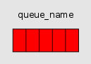
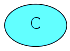

<!-- more -->

## 介绍

RabbitMQ 是一种消息代理，它接受并转发消息。你可以将其看作一个邮局：当你把信件放进邮箱时，你可以确信邮递员最终会将信件送到收件人手中。在这个比喻中，RabbitMQ 就像是一个邮箱、一个邮局和一个邮递员。

RabbitMQ 与邮局的主要区别在于，它不处理纸质文件，而是接受、存储和转发二进制数据块——即消息。

RabbitMQ 以及消息传递通常使用一些术语。

- Producing 意味着发送。发送消息的程序被称为生产者（producer）：

- 在 RabbitMQ 中，队列是指邮箱的名称。尽管消息流经 RabbitMQ 和你的应用程序，但它们只能存储在一个队列内。队列只受主机内存和磁盘限制的约束，实际上是一个大型消息缓冲区。多个生产者可以向一个队列发送消息，许多消费者也可以尝试从一个队列接收数据。以下是队列（queue）的表示方式：

- Consuming 和 receiving 有类似的含义。消费者（consumer）是一个主要等待接收消息的程序：

请注意，生产者、消费者和代理不必驻留在同一主机上；实际上，在大多数应用程序中它们都不在同一主机上。一个应用程序也可以既是生产者又是消费者。

:::info 注意
本系列中的代码示例均由 C#/.NET 实现

[RabbitDemo地址](https://github.com/goodsxx/RabbitMQDemo)
:::
