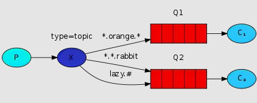

::: tip ✨✨✨✨✨
在 RabbitMQ 中，主题模式（Topic Model）是一种比直接交换机更灵活的交换机类型，它可以根据消息携带的 Routing Key 和队列绑定时设定的 Binding Key 进行模糊匹配。主题模式可以使用通配符 `*` 和 `#` 对 Routing Key 进行模糊匹配。
:::

<!-- more -->

## 介绍

在 RabbitMQ 中，主题模式是一种比直接交换机更灵活的交换机类型，它可以根据消息携带的 Routing Key 和队列绑定时设定的 Binding Key 进行模糊匹配。主题模式可以使用通配符 `*` 和 `#` 对 Routing Key 进行模糊匹配。

- `*` 匹配一个单词（单词由点号分隔）
- `#` 匹配零个或多个单词

例如，在一个 Routing Key 为 `first.second.third.fourth` 的消息中，`*.second.*.fourth` 可以匹配该消息，但 `first.#.fourth` 也可以匹配该消息。

## 使用场景

主题模式适用于需要将消息根据多个条件进行过滤和分类的场景，比如在电商系统中，需要将新订单的消息根据商品类型和区域分别发送到不同的队列中进行处理。

## 代码示例

实现一个如下图所示的主题模式示例：



:::tabs
@tab 生产者
```cs
using RabbitMQ.Client;
using System.Text;

// 创建连接工厂对象，指定主机名和登录凭据信息
ConnectionFactory factory = new()
{
    HostName = "192.168.3.100",
    Port = 5672,
    UserName = "guest",
    Password = "guest"
};

// 创建连接和通道
using var connection = factory.CreateConnection();
using var channel = connection.CreateModel();

// 声明主题交换机
channel.ExchangeDeclare(
    exchange: "topic_logs",
    type: ExchangeType.Topic);

// 发送消息到交换机
string key1 = "quick.orange.rabbit";
string key2 = "lazy.orange.elephant";
string key3 = "quick.orange.fox";
string key4 = "quick.brown.fox";
string key5 = "orange";
string key6 = "quick.orange.new.rabbit";
string key7 = "lazy.orange.new.rabbit";
byte[] body1 = Encoding.UTF8.GetBytes($"{key1} 消息");
byte[] body2 = Encoding.UTF8.GetBytes($"{key2} 消息");
byte[] body3 = Encoding.UTF8.GetBytes($"{key3} 消息");
byte[] body4 = Encoding.UTF8.GetBytes($"{key4} 消息");
byte[] body5 = Encoding.UTF8.GetBytes($"{key5} 消息");
byte[] body6 = Encoding.UTF8.GetBytes($"{key6} 消息");
byte[] body7 = Encoding.UTF8.GetBytes($"{key7} 消息");

// 将消息发送到不同的队列，根据 Routing Key 进行匹配
channel.BasicPublish(
    exchange: "topic_logs", // 指定交换机名称
    routingKey: key1, // 指定 Routing Key
    basicProperties: null,
    body: body1);
Console.WriteLine(" [生产者] 发送消息：{0}", key1);

channel.BasicPublish(
    exchange: "topic_logs", // 指定交换机名称
    routingKey: key2, // 指定 Routing Key
    basicProperties: null,
    body: body2);
Console.WriteLine(" [生产者] 发送消息：{0}", key2);

channel.BasicPublish(
    exchange: "topic_logs", // 指定交换机名称
    routingKey: key3, // 指定 Routing Key
    basicProperties: null,
    body: body3);
Console.WriteLine(" [生产者] 发送消息：{0}", key3);

channel.BasicPublish(
    exchange: "topic_logs", // 指定交换机名称
    routingKey: key4, // 指定 Routing Key
    basicProperties: null,
    body: body4);
Console.WriteLine(" [生产者] 发送消息：{0}", key4);

channel.BasicPublish(
    exchange: "topic_logs", // 指定交换机名称
    routingKey: key5, // 指定 Routing Key
    basicProperties: null,
    body: body5);
Console.WriteLine(" [生产者] 发送消息：{0}", key5);

channel.BasicPublish(
    exchange: "topic_logs", // 指定交换机名称
    routingKey: key6, // 指定 Routing Key
    basicProperties: null,
    body: body6);
Console.WriteLine(" [生产者] 发送消息：{0}", key6);

channel.BasicPublish(
    exchange: "topic_logs", // 指定交换机名称
    routingKey: key7, // 指定 Routing Key
    basicProperties: null,
    body: body7);
Console.WriteLine(" [生产者] 发送消息：{0}", key7);

Console.WriteLine("按 [enter] 键退出");
Console.ReadLine();
```

@tab 消费者1
```cs
using RabbitMQ.Client;
using RabbitMQ.Client.Events;
using System.Text;

// 创建连接工厂对象，指定主机名和登录凭据信息
ConnectionFactory factory = new()
{
    HostName = "192.168.3.100",
    Port = 5672,
    UserName = "guest",
    Password = "guest"
};

// 创建连接和通道
using var connection = factory.CreateConnection();
using var channel = connection.CreateModel();

// 声明主题交换机
channel.ExchangeDeclare(
    exchange: "topic_logs",
    type: ExchangeType.Topic);

// 声明队列，让系统随机生成队列名
var queueName = channel.QueueDeclare().QueueName;

// 绑定队列到交换机，为每个队列分别指定 Binding Key
channel.QueueBind(queue: queueName,
                  exchange: "topic_logs",
                  routingKey: "*.orange.*");

Console.WriteLine(" [消费者1] 等待 [*.orange.*] 消息中.");

// 创建事件消费者，用于处理接收到的消息
var consumer = new EventingBasicConsumer(channel);

// 处理接收到的消息
consumer.Received += (model, ea) =>
{
    ReadOnlyMemory<byte> body = ea.Body.ToArray();
    string message = Encoding.UTF8.GetString(body.Span);
    Console.WriteLine(" [消费者1] 收到消息: {0}", message);
};

// 启动消费者，开始监听队列
channel.BasicConsume(queue: queueName,
                     autoAck: true,
                     consumer: consumer);

Console.WriteLine("按 [enter] 键退出");
Console.ReadLine();
```

@tab 消费者2
```cs
using RabbitMQ.Client;
using RabbitMQ.Client.Events;
using System.Text;

// 创建连接工厂对象，指定主机名和登录凭据信息
ConnectionFactory factory = new()
{
    HostName = "192.168.3.100",
    Port = 5672,
    UserName = "guest",
    Password = "guest"
};

// 创建连接和通道
using var connection = factory.CreateConnection();
using var channel = connection.CreateModel();

// 声明主题交换机
channel.ExchangeDeclare(
    exchange: "topic_logs",
    type: ExchangeType.Topic);

// 声明队列，让系统随机生成队列名
var queueName = channel.QueueDeclare().QueueName;

// 绑定队列到交换机，为每个队列分别指定 Binding Key
channel.QueueBind(queue: queueName,
                  exchange: "topic_logs",
                  routingKey: "*.*.rabbit");
channel.QueueBind(queue: queueName,
                  exchange: "topic_logs",
                  routingKey: "lazy.#");

Console.WriteLine(" [消费者2] 等待 [*.*.rabbit]和[lazy.#] 消息中.");

// 创建事件消费者，用于处理接收到的消息
var consumer = new EventingBasicConsumer(channel);

// 处理接收到的消息
consumer.Received += (model, ea) =>
{
    ReadOnlyMemory<byte> body = ea.Body.ToArray();
    string message = Encoding.UTF8.GetString(body.Span);
    Console.WriteLine(" [消费者2] 收到消息: {0}", message);
};

// 启动消费者，开始监听队列
channel.BasicConsume(queue: queueName,
                     autoAck: true,
                     consumer: consumer);

Console.WriteLine("按 [enter] 键退出");
Console.ReadLine();
```
:::

分别启动消费者及生产者客户端，得到如下输出：

:::tabs
@tab 生产者
```shell
[生产者] 发送消息：quick.orange.rabbit
[生产者] 发送消息：lazy.orange.elephant
[生产者] 发送消息：quick.orange.fox
[生产者] 发送消息：quick.brown.fox
[生产者] 发送消息：orange
[生产者] 发送消息：quick.orange.new.rabbit
[生产者] 发送消息：lazy.orange.new.rabbit
按 [enter] 键退出
```
@tab 消费者1
```shell
[消费者1] 等待 [*.orange.*] 消息中.
按 [enter] 键退出
[消费者1] 收到消息: quick.orange.rabbit 消息
[消费者1] 收到消息: lazy.orange.elephant 消息
[消费者1] 收到消息: quick.orange.fox 消息
```
@tab 消费者2
```shell
[消费者2] 等待 [*.*.rabbit]和[lazy.#] 消息中.
按 [enter] 键退出
[消费者2] 收到消息: quick.orange.rabbit 消息
[消费者2] 收到消息: lazy.orange.elephant 消息
[消费者2] 收到消息: lazy.orange.new.rabbit 消息
```
:::

在这个例子中，我们将发送描述动物的消息。这些消息将使用由三个单词（两个点）组成的路由键发送。路由键中的第一个单词描述速度，第二个单词描述颜色，第三个单词描述物种：`<speed>.<colour>.<species>`。

我们创建了三个绑定：Q1 绑定了绑定键 `.orange.`，而 Q2 绑定了 `..rabbit` 和 `lazy.#`。

这些绑定可以总结为：

Q1 对所有橙色动物感兴趣。
Q2 想听关于兔子和关于懒惰动物的一切。

根据通配符模糊匹配的规则，路由键设置为 `quick.orange.rabbit` 的消息将被传递到两个队列中。消息 `lazy.orange.elephant` 也会传递到它们两个。另一方面，`quick.orange.fox` 只会进入第一个队列，`lazy.brown.fox` 则只会进入第二个队列。`lazy.pink.rabbit` 虽然与两个绑定匹配，但仅传递到第二个队列一次。`quick.brown.fox`、`orange` 和 `quick.orange.new.rabbit` 不匹配任何绑定，因此将被丢弃。

`lazy.orange.new.rabbit` 尽管有四个单词，但将匹配最后一个绑定，并将传递到第二个队列。