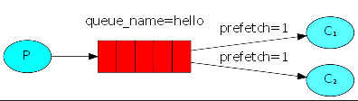

::: tip ✨✨✨✨✨
工作队列模式（Work Queue Mode）是一个常见的消息队列应用模式，通常是一个生产者对多个消费者的模型。在该模式下，生产者将待处理的任务放入队列中，由多个消费者从队列中获取任务并进行处理。例如将耗时的任务异步地分配给多个工作者进行处理。在工作队列中，消息生产者将待处理的任务放入队列中，由一组工作者来竞争性地消费这些任务，并将处理结果返回给消息代理或存储到数据仓库中。
:::

<!-- more -->

## 介绍

工作队列模式（Work Queue Mode）是一个常见的消息队列应用模式，通它包括一个或多个生产者将消息发送到队列中，然后一个或多个消费者从该队列接收并处理消息。工作队列模式的特点在于可以在多个消费者之间分配和平衡负载，并且可以确保每个消息只被消费一次。


## 使用场景

工作队列模式适用于需要处理大量任务的场景，例如：

- 后台任务处理：通过将任务放入队列中，让多个消费者异步处理任务，从而提高系统的吞吐量和性能。
- 负载均衡：通过多个消费者共同处理队列中的任务，实现任务的分配和负载均衡。

## 循环调度

在循环调度模式中，RabbitMQ 会尝试将消息平均分配给所有可用的消费者，而不考虑每个消费者的处理能力和负载情况。当消费者数量不变时，每个消费者将在轮换周期内依次接收到消息。

### 代码示例

:::tabs
@tab 生产者

```cs
using RabbitMQ.Client;
using System.Text;

// 创建ConnectionFactory实例，设置RabbitMQ节点的主机名
ConnectionFactory factory = new()
{
    HostName = "192.168.3.100",
    Port = 5672,
    UserName = "guest",
    Password = "guest"
};
using var connection = factory.CreateConnection(); // 创建连接
using var channel = connection.CreateModel(); // 创建通道

// 声明队列，如果该队列不存在，则会自动创建
channel.QueueDeclare(queue: "work_queue",
                     durable: true, //设置队列为持久化
                     exclusive: false,
                     autoDelete: false,
                     arguments: null);
// 设置消息为持久化
var properties = channel.CreateBasicProperties();
properties.Persistent = true;

for (int i = 0; i < 10; i++)
{
    string message = $"任务消息 {i}"; // 待发送的消息
    var body = Encoding.UTF8.GetBytes(message); // 将消息转换成字节数组

    // 发布消息到队列中，exchange参数为空表示默认交换器
    channel.BasicPublish(exchange: "",
                         routingKey: "work_queue", // 消息的路由键为work_queue
                         basicProperties: properties,
                         body: body);
    Console.WriteLine("[生产者] 发送消息：{0}", message); // 输出发送的消息内容
}
Console.WriteLine("按[Enter]键退出");
Console.ReadLine(); // 阻塞等待用户按回车键
```

@tab 消费者1
```cs
using RabbitMQ.Client;
using RabbitMQ.Client.Events;
using System.Text;

// 创建连接工厂对象，指定主机名和登录凭据信息
ConnectionFactory factory = new()
{
    HostName = "192.168.3.100",
    Port = 5672,
    UserName = "guest",
    Password = "guest"
};
using var connection = factory.CreateConnection(); // 创建连接
using var channel = connection.CreateModel(); // 创建通道

// 声明队列，如果该队列不存在，则会自动创建
channel.QueueDeclare(queue: "work_queue",
                     durable: true, // 设置队列为持久化
                     exclusive: false,
                     autoDelete: false,
                     arguments: null);

Random random = new();

var totalTimes = 0;//总耗时
var num = 0;//处理消息数

// 创建一个事件基本消费者
var consumer = new EventingBasicConsumer(channel);
consumer.Received += async (model, ea) =>
{
    ReadOnlyMemory<byte> body = ea.Body.ToArray();
    string message = Encoding.UTF8.GetString(body.Span);
    Console.WriteLine($"[消费者1] 收到消息：{message}");

    // 模拟耗时的任务处理
    var time = random.Next(0, 5000);
    await Task.Delay(time);

    Console.WriteLine($"[消费者1] 完成: 耗时{time}ms");

    // 当消费者完成任务后，手动确认消息已经被消费
    channel.BasicAck(deliveryTag: ea.DeliveryTag, multiple: false);

    totalTimes += time;
    num += 1;

    Console.WriteLine($"[消费者1] 目前处理{num}条消息，共耗时{totalTimes}ms");
};
// 启动消费者
channel.BasicConsume(queue: "work_queue",
                     autoAck: false, // 关闭自动确认消息消费
                     consumer: consumer); // 指定消费者
Console.WriteLine("按[Enter]键退出");
Console.ReadLine();
```

@tab 消费者2
```cs
using RabbitMQ.Client;
using RabbitMQ.Client.Events;
using System.Text;

// 创建连接工厂对象，指定主机名和登录凭据信息
ConnectionFactory factory = new()
{
    HostName = "192.168.3.100",
    Port = 5672,
    UserName = "guest",
    Password = "guest"
};
using var connection = factory.CreateConnection(); // 创建连接
using var channel = connection.CreateModel(); // 创建通道

// 声明队列，如果该队列不存在，则会自动创建
channel.QueueDeclare(queue: "work_queue",
                     durable: true, // 设置队列为持久化
                     exclusive: false,
                     autoDelete: false,
                     arguments: null);

Random random = new();

var totalTimes = 0;//总耗时
var num = 0;//处理消息数

// 创建一个事件基本消费者
var consumer = new EventingBasicConsumer(channel);
consumer.Received += async (model, ea) =>
{
    ReadOnlyMemory<byte> body = ea.Body.ToArray();
    string message = Encoding.UTF8.GetString(body.Span);
    Console.WriteLine($"[消费者2] 收到消息：{message}");

    // 模拟耗时的任务处理
    var time = random.Next(0, 5000);
    await Task.Delay(time);

    Console.WriteLine($"[消费者2] 完成: 耗时{time}ms");

    // 当消费者完成任务后，手动确认消息已经被消费
    channel.BasicAck(deliveryTag: ea.DeliveryTag, multiple: false);

    totalTimes += time;
    num += 1;

    Console.WriteLine($"[消费者2] 目前处理{num}条消息，共耗时{totalTimes}ms");
};
// 启动消费者
channel.BasicConsume(queue: "work_queue",
                     autoAck: false, // 关闭自动确认消息消费
                     consumer: consumer); // 指定消费者
Console.WriteLine("按[Enter]键退出");
Console.ReadLine();
```
:::

分别启动消费者及生产者客户端，得到如下输出：

:::tabs
@tab 生产者
```shell
[生产者] 发送消息：任务消息 0
[生产者] 发送消息：任务消息 1
[生产者] 发送消息：任务消息 2
[生产者] 发送消息：任务消息 3
[生产者] 发送消息：任务消息 4
[生产者] 发送消息：任务消息 5
[生产者] 发送消息：任务消息 6
[生产者] 发送消息：任务消息 7
[生产者] 发送消息：任务消息 8
[生产者] 发送消息：任务消息 9
```
@tab 消费者1
```shell
按任意键退出
[消费者1] 收到消息：任务消息 1
[消费者1] 收到消息：任务消息 3
[消费者1] 收到消息：任务消息 5
[消费者1] 收到消息：任务消息 7
[消费者1] 收到消息：任务消息 9
[消费者1] 完成: 耗时118ms
[消费者1] 目前处理1条消息，共耗时118ms
[消费者1] 完成: 耗时4135ms
[消费者1] 目前处理2条消息，共耗时4253ms
[消费者1] 完成: 耗时4324ms
[消费者1] 目前处理3条消息，共耗时8577ms
[消费者1] 完成: 耗时4512ms
[消费者1] 目前处理4条消息，共耗时13089ms
[消费者1] 完成: 耗时4575ms
[消费者1] 目前处理5条消息，共耗时17664ms
```
@tab 消费者2
```shell
 按任意键退出
[消费者2] 收到消息：任务消息 0
[消费者2] 收到消息：任务消息 2
[消费者2] 收到消息：任务消息 4
[消费者2] 收到消息：任务消息 6
[消费者2] 收到消息：任务消息 8
[消费者2] 完成: 耗时286ms
[消费者2] 目前处理1条消息，共耗时286ms
[消费者2] 完成: 耗时386ms
[消费者2] 目前处理2条消息，共耗时672ms
[消费者2] 完成: 耗时1516ms
[消费者2] 目前处理3条消息，共耗时2188ms
[消费者2] 完成: 耗时3755ms
[消费者2] 目前处理4条消息，共耗时5943ms
[消费者2] 完成: 耗时4894ms
[消费者2] 目前处理5条消息，共耗时10837ms
```
:::

从输出结果中我们可以看到，消费者1和消费者2都处理了5条消息，但是耗时却相差距大，由此我们可以验证，在循环调度模式中，RabbitMQ 将消息平均分配给所有可用的消费者，而不考虑每个消费者的处理能力和负载情况。当消费者数量不变时，每个消费者将在轮换周期内依次接收到消息。

## 公平调度

在公平调度模式中，RabbitMQ 会尝试将消息均匀地分配给所有可用的消费者，并确保每个消费者一次只接收一个消息。这样，即使某个消费者的处理时间较长或负载较重，也不会影响其他消费者的正常处理。



### 代码示例

生产者代码与[循环调度](#循环调度)中一致。

:::tabs
@tab 消费者1
```cs{23-24}
using RabbitMQ.Client;
using RabbitMQ.Client.Events;
using System.Text;

// 创建连接工厂对象，指定主机名和登录凭据信息
ConnectionFactory factory = new()
{
    HostName = "192.168.3.100",
    Port = 5672,
    UserName = "guest",
    Password = "guest"
};
using var connection = factory.CreateConnection(); // 创建连接
using var channel = connection.CreateModel(); // 创建通道

// 声明队列，如果该队列不存在，则会自动创建
channel.QueueDeclare(queue: "work_queue",
                     durable: true, // 设置队列为持久化
                     exclusive: false,
                     autoDelete: false,
                     arguments: null);

// 设置每个消费者最多只能处理一条消息，避免某些消费者被过度负载而导致其他消费者处于空闲状态
channel.BasicQos(0, 1, false);

Random random = new();

var totalTimes = 0;//总耗时
var num = 0;//处理消息数

// 创建一个事件基本消费者
var consumer = new EventingBasicConsumer(channel);
consumer.Received += async (model, ea) =>
{
    ReadOnlyMemory<byte> body = ea.Body.ToArray();
    string message = Encoding.UTF8.GetString(body.Span);
    Console.WriteLine($"[消费者1] 收到消息：{message}");

    // 模拟耗时的任务处理
    var time = random.Next(0, 5000);
    await Task.Delay(time);

    Console.WriteLine($"[消费者1] 完成: 耗时{time}ms");

    // 当消费者完成任务后，手动确认消息已经被消费
    channel.BasicAck(deliveryTag: ea.DeliveryTag, multiple: false);

    totalTimes += time;
    num += 1;

    Console.WriteLine($"[消费者1] 目前处理{num}条消息，共耗时{totalTimes}ms");
};
// 启动消费者
channel.BasicConsume(queue: "work_queue",
                     autoAck: false, // 关闭自动确认消息消费
                     consumer: consumer); // 指定消费者
Console.WriteLine("按任意键退出");
Console.ReadLine();
```

@tab 消费者2
```cs{23-24}
using RabbitMQ.Client;
using RabbitMQ.Client.Events;
using System.Text;

// 创建连接工厂对象，指定主机名和登录凭据信息
ConnectionFactory factory = new()
{
    HostName = "192.168.3.100",
    Port = 5672,
    UserName = "guest",
    Password = "guest"
};
using var connection = factory.CreateConnection(); // 创建连接
using var channel = connection.CreateModel(); // 创建通道

// 声明队列，如果该队列不存在，则会自动创建
channel.QueueDeclare(queue: "work_queue",
                     durable: true, // 设置队列为持久化
                     exclusive: false,
                     autoDelete: false,
                     arguments: null);

// 设置每个消费者最多只能处理一条消息，避免某些消费者被过度负载而导致其他消费者处于空闲状态
channel.BasicQos(0, 1, false);

Random random = new();

var totalTimes = 0;//总耗时
var num = 0;//处理消息数

// 创建一个事件基本消费者
var consumer = new EventingBasicConsumer(channel);
consumer.Received += async (model, ea) =>
{
    ReadOnlyMemory<byte> body = ea.Body.ToArray();
    string message = Encoding.UTF8.GetString(body.Span);
    Console.WriteLine($"[消费者2] 收到消息：{message}");

    // 模拟耗时的任务处理
    var time = random.Next(1000, 5000);
    await Task.Delay(time);

    Console.WriteLine($"[消费者2] 完成: 耗时{time}ms");

    // 当消费者完成任务后，手动确认消息已经被消费
    channel.BasicAck(deliveryTag: ea.DeliveryTag, multiple: false);

    totalTimes += time;
    num += 1;

    Console.WriteLine($"[消费者2] 目前处理{num}条消息，共耗时{totalTimes}ms");
};
// 启动消费者
channel.BasicConsume(queue: "work_queue",
                     autoAck: false, // 关闭自动确认消息消费
                     consumer: consumer); // 指定消费者
Console.WriteLine(" 按任意键退出");
Console.ReadLine();
```
:::

分别启动消费者及生产者客户端，得到如下输出：

:::tabs
@tab 生产者
```shell
[生产者] 发送消息：任务消息 0
[生产者] 发送消息：任务消息 1
[生产者] 发送消息：任务消息 2
[生产者] 发送消息：任务消息 3
[生产者] 发送消息：任务消息 4
[生产者] 发送消息：任务消息 5
[生产者] 发送消息：任务消息 6
[生产者] 发送消息：任务消息 7
[生产者] 发送消息：任务消息 8
[生产者] 发送消息：任务消息 9
```
@tab 消费者1
```shell
按任意键退出
[消费者1] 收到消息：任务消息 1
[消费者1] 完成: 耗时4609ms
[消费者1] 目前处理1条消息，共耗时4609ms
[消费者1] 收到消息：任务消息 3
[消费者1] 完成: 耗时1905ms
[消费者1] 目前处理2条消息，共耗时6514ms
[消费者1] 收到消息：任务消息 5
[消费者1] 完成: 耗时337ms
[消费者1] 目前处理3条消息，共耗时6851ms
[消费者1] 收到消息：任务消息 6
[消费者1] 完成: 耗时3092ms
[消费者1] 目前处理4条消息，共耗时9943ms
[消费者1] 收到消息：任务消息 8
[消费者1] 完成: 耗时2613ms
[消费者1] 目前处理5条消息，共耗时12556ms
[消费者1] 收到消息：任务消息 9
[消费者1] 完成: 耗时1898ms
[消费者1] 目前处理6条消息，共耗时14454ms
```
@tab 消费者2
```shell
按任意键退出
[消费者2] 收到消息：任务消息 0
[消费者2] 完成: 耗时2560ms
[消费者2] 目前处理1条消息，共耗时2560ms
[消费者2] 收到消息：任务消息 2
[消费者2] 完成: 耗时3316ms
[消费者2] 目前处理2条消息，共耗时5876ms
[消费者2] 收到消息：任务消息 4
[消费者2] 完成: 耗时3738ms
[消费者2] 目前处理3条消息，共耗时9614ms
[消费者2] 收到消息：任务消息 7
[消费者2] 完成: 耗时4111ms
[消费者2] 目前处理4条消息，共耗时13725m
```
:::

从输出结果中我们可以看到，消费者1和消费者2因为处理能力的不同，分别处理了不同数量的消息。

所以我们可以在代码中通过 `channel.BasicQos(0, 1, false)` 设置每个消费者最多只能处理一条消息，避免某些消费者被过度负载而导致其他消费者处于空闲状态。