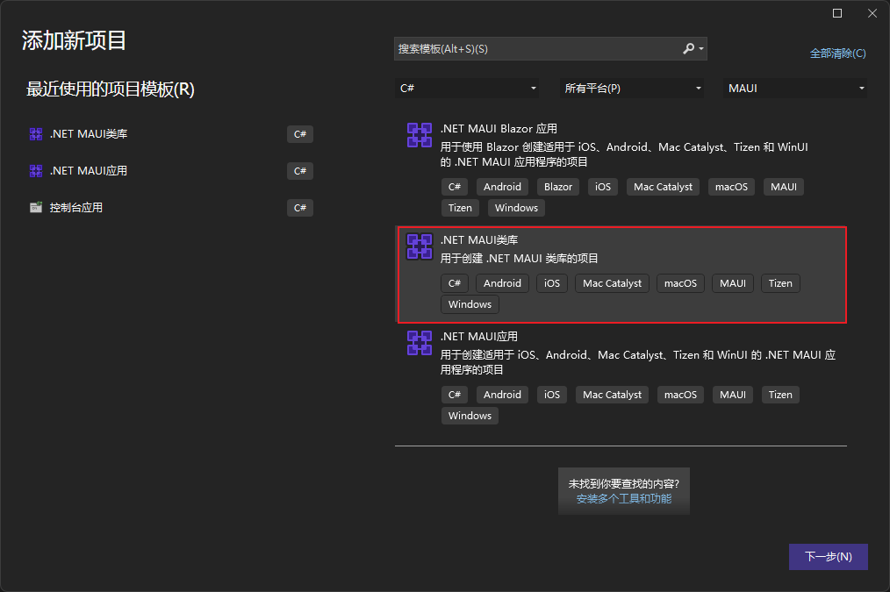

::: tip ✨✨✨✨✨
混合开发的概念是相对与原生开发来说的：App 不直接运行原生程序，而是在原生程序中运行一个 Web 程序，原生程序中包含 Web 运行时，用于承载 Web 页面。暂且将原生应用称之为 Web 容器，Web 容器应该能让 JavaScript 代码与原生平台的代码交互，互相调用，同时为上层提供交互逻辑，例如导航，事件，Cookie，刷新等内容。

本章我们将讲解如何通过自定义 MAUI 中的 WebView 控件实现 MAUI + Web 混合开发。
:::

<!-- more -->

## 自定义 HybridWebView 控件

基于 WebView 使用处理程序创建自定义 HybridWebView 控件。

本章节代码来自开源项目：[MauiCSharpInteropWebView](https://github.com/Eilon/MauiCSharpInteropWebView)

### 新建 .NET MAUI 类库项目

新建 .NET MAUI 类库项目，并命名为 MauiCSharpInteropWebView。



### 创建 HybridWebView 跨平台控件

HybridWebView 类作为跨平台控件需派生字自 WebView 类。

```cs
using System.Text.Json;

namespace HybridWebView
{
    public partial class HybridWebView : WebView
    {
        public string MainFile { get; set; }

        /// <summary>
        ///  包含web应用程序内容的应用程序“原始”资产资源中的路径。例如，如果文件位于“project folder/Resources/Raw/hybrid_root”中，则将该属性设置为“hybrid_root”
        /// </summary>
        public string HybridAssetRoot { get; set; }

        /// <summary>
        /// JavaScript方法调用的目标对象。当从JavaScript发送“invoke”消息时，被调用的方法将位于该对象上，并且任何指定的参数都将被传入。
        /// </summary>
        public object JSInvokeTarget { get; set; }

        public event EventHandler<HybridWebViewRawMessageReceivedEventArgs> RawMessageReceived;

        protected override void OnHandlerChanged()
        {
            base.OnHandlerChanged();

            InitializeHybridWebView();
        }

        partial void InitializeHybridWebView();

        /// <summary>
        /// 调用名为< paramref name="methodName"/>的JavaScript方法，并通过对每个参数值进行JSON编码，选择性地传入由< paramref name="paramValues"/>指定的参数值。
        /// </summary>
        /// <param name="methodName">要调用的JavaScript方法的名称</param>
        /// <param name="paramValues">通过对每个对象进行JSON编码，将对象的可选数组传递给JavaScript方法</param>
        /// <returns>包含被调用方法的返回值的字符串</returns>
        public async Task<string> InvokeJsMethodAsync(string methodName, params object[] paramValues)
        {
            if (string.IsNullOrEmpty(methodName))
            {
                throw new ArgumentException($"The method name cannot be null or empty.", nameof(methodName));
            }

            return await EvaluateJavaScriptAsync($"{methodName}({(paramValues == null ? string.Empty : string.Join(", ", paramValues.Select(v => JsonSerializer.Serialize(v))))})");
        }

        /// <summary>
        /// 调用名为< paramref name="methodName"/>的JavaScript方法，并通过对每个参数值进行JSON编码，选择性地传入由< paramref name="paramValues"/>指定的参数值
        /// </summary>
        /// <typeparam name="TReturnType">要从JSON反序列化的返回值的类型</typeparam>
        /// <param name="methodName">要调用的JavaScript方法的名称</param>
        /// <param name="paramValues">通过对每个对象进行JSON编码，将对象的可选数组传递给JavaScript方法</param>
        /// <returns>包含被调用方法的返回值的< typeparamref name = " TReturnType "/>类型的对象</returns>
        public async Task<TReturnType> InvokeJsMethodAsync<TReturnType>(string methodName, params object[] paramValues)
        {
            var stringResult = await InvokeJsMethodAsync(methodName, paramValues);

            return JsonSerializer.Deserialize<TReturnType>(stringResult);
        }

        public virtual void OnMessageReceived(string message)
        {
            var messageData = JsonSerializer.Deserialize<WebMessageData>(message);
            switch (messageData.MessageType)
            {
                case 0: // "raw" message (just a string)
                    RawMessageReceived?.Invoke(this, new HybridWebViewRawMessageReceivedEventArgs(messageData.MessageContent));
                    break;
                case 1: // "invoke" message
                    var invokeData = JsonSerializer.Deserialize<JSInvokeMethodData>(messageData.MessageContent);
                    InvokeDotNetMethod(invokeData);
                    break;
                default:
                    throw new InvalidOperationException($"未知的消息类型: {messageData.MessageType}. 消息内容: {messageData.MessageContent}");
            }

        }

        private void InvokeDotNetMethod(JSInvokeMethodData invokeData)
        {
            if (JSInvokeTarget is null)
            {
                throw new NotImplementedException($"{nameof(JSInvokeTarget)}属性必须有一个值，以便从JavaScript调用.NET方法。");
            }

            var invokeMethod = JSInvokeTarget.GetType().GetMethod(invokeData.MethodName, System.Reflection.BindingFlags.Public | System.Reflection.BindingFlags.Static | System.Reflection.BindingFlags.Instance | System.Reflection.BindingFlags.InvokeMethod);

            if (invokeData.ParamValues != null && invokeMethod.GetParameters().Length != invokeData.ParamValues.Length)
            {
                throw new InvalidOperationException($"{nameof(JSInvokeTarget)}的方法{invokeData.MethodName} ({invokeMethod.GetParameters().Length})上的参数数量与从JavaScript代码({invokeData.ParamValues.Length})传递的值的数量不匹配。");
            }

            var paramObjectValues =
                invokeData.ParamValues?
                    .Zip(invokeMethod.GetParameters(), (s, p) => JsonSerializer.Deserialize(s, p.ParameterType))
                    .ToArray();

            var returnValue = invokeMethod.Invoke(JSInvokeTarget, paramObjectValues);
        }

        private sealed class JSInvokeMethodData
        {
            public string MethodName { get; set; }
            public string[] ParamValues { get; set; }
        }

        private sealed class WebMessageData
        {
            public int MessageType { get; set; }
            public string MessageContent { get; set; }
        }

        internal static async Task<string> GetAssetContentAsync(string assetPath)
        {
            using var stream = await GetAssetStreamAsync(assetPath);
            if (stream == null)
            {
                return null;
            }
            using var reader = new StreamReader(stream);

            var contents = reader.ReadToEnd();

            return contents;
        }

        internal static async Task<Stream> GetAssetStreamAsync(string assetPath)
        {
            if (!await FileSystem.AppPackageFileExistsAsync(assetPath))
            {
                return null;
            }
            return await FileSystem.OpenAppPackageFileAsync(assetPath);
        }
    }
}
```

### 创建 HybridWebViewHandler 处理程序

HybridWebViewHandler 类作为 HybridWebView 控件的处理程序需派生自 WebViewHandler 处理程序。

```cs
using Microsoft.Maui.Handlers;

namespace HybridWebView
{
    public partial class HybridWebViewHandler : WebViewHandler
    {
        public static IPropertyMapper<IWebView, IWebViewHandler> HybridWebViewMapper = new PropertyMapper<IWebView, IWebViewHandler>(WebViewHandler.Mapper)
        {
#if __ANDROID__
            [nameof(Android.Webkit.WebViewClient)] = MapHybridWebViewClient,
#endif
        };

        public HybridWebViewHandler() : base(HybridWebViewMapper, CommandMapper)
        {
        }

        public HybridWebViewHandler(IPropertyMapper? mapper = null, CommandMapper? commandMapper = null)
            : base(mapper ?? HybridWebViewMapper, commandMapper ?? CommandMapper)
        {
        }

#if ANDROID
        public static void MapHybridWebViewClient(IWebViewHandler handler, IWebView webView)
        {
            if (handler is HybridWebViewHandler platformHandler)
            {
                var webViewClient = new AndroidHybridWebViewClient(platformHandler);
                handler.PlatformView.SetWebViewClient(webViewClient);

                // TODO: There doesn't seem to be a way to override MapWebViewClient() in maui/src/Core/src/Handlers/WebView/WebViewHandler.Android.cs
                // in such a way that it knows of the custom MauiWebViewClient that we're creating. So, we use private reflection to set it on the
                // instance. We might end up duplicating WebView/BlazorWebView anyway, in which case we wouldn't need this workaround.
                var webViewClientField = typeof(WebViewHandler).GetField("_webViewClient", System.Reflection.BindingFlags.NonPublic | System.Reflection.BindingFlags.Instance | System.Reflection.BindingFlags.FlattenHierarchy);
                webViewClientField.SetValue(handler, webViewClient);
            }
        }
#endif
    }
}
```

### 创建 HybridWebViewRawMessageReceivedEventArgs 类

```cs
namespace HybridWebView
{
    public class HybridWebViewRawMessageReceivedEventArgs : EventArgs
    {
        public HybridWebViewRawMessageReceivedEventArgs(string message)
        {
            Message = message;
        }

        public string Message { get; }
    }
}
```

### 创建 HybridWebViewServiceCollectionExtensions 类

```cs
using HybridWebView;

namespace Microsoft.Extensions.DependencyInjection
{
    public static class HybridWebViewServiceCollectionExtensions
    {
		public static void AddHybridWebView(this IServiceCollection services)
		{
			services.ConfigureMauiHandlers(static handlers => handlers.AddHandler<HybridWebView.HybridWebView, HybridWebViewHandler>());
		}
	}
}
```

### 创建平台控件

为处理程序创建映射器后，必须在所有平台上提供处理程序实现。 这可以通过在 Platforms 文件夹的子文件夹中添加分部类处理程序实现来实现。 或者，可以将项目配置为支持基于文件名的多目标或基于文件夹的多目标，或同时支持这两者。

#### Android 平台控件

#####  创建 AndroidHybridWebViewClient 类

```cs
using Android.Webkit;
using Microsoft.Maui.Platform;
using System.Text;
using AWebView = Android.Webkit.WebView;

namespace HybridWebView
{
    public class AndroidHybridWebViewClient : MauiWebViewClient
    {
        private readonly HybridWebViewHandler _handler;

        public AndroidHybridWebViewClient(HybridWebViewHandler handler) : base(handler)
        {
            _handler = handler;
        }

        public override WebResourceResponse ShouldInterceptRequest(AWebView view, IWebResourceRequest request)
        {
            if (new Uri(request.Url.ToString()) is Uri uri && HybridWebView.AppOriginUri.IsBaseOf(uri))
            {
                var relativePath = HybridWebView.AppOriginUri.MakeRelativeUri(uri).ToString().Replace('/', '\\');

                string contentType;
                if (string.IsNullOrEmpty(relativePath))
                {
                    relativePath = ((HybridWebView)_handler.VirtualView).MainFile;
                    contentType = "text/html";
                }
                else
                {
                    var requestExtension = Path.GetExtension(relativePath);
                    contentType = requestExtension switch
                    {
                        ".htm" or ".html" => "text/html",
                        ".js" => "application/javascript",
                        ".css" => "text/css",
                        _ => "text/plain",
                    };
                }

                var assetPath = Path.Combine(((HybridWebView)_handler.VirtualView).HybridAssetRoot, relativePath);

                var contentStream = PlatformOpenAppPackageFile(assetPath);
                if (contentStream is null)
                {
                    var notFoundContent = "Resource not found (404)";

                    var notFoundByteArray = Encoding.UTF8.GetBytes(notFoundContent);
                    var notFoundContentStream = new MemoryStream(notFoundByteArray);

                    return new WebResourceResponse("text/plain", "UTF-8", 404, "Not Found", GetHeaders("text/plain"), notFoundContentStream);
                }
                else
                {
                    // TODO: We don't know the content length because Android doesn't tell us. Seems to work without it!
                    return new WebResourceResponse(contentType, "UTF-8", 200, "OK", GetHeaders(contentType), contentStream);
                }
            }
            else
            {
                return base.ShouldInterceptRequest(view, request);
            }
        }

        Stream PlatformOpenAppPackageFile(string filename)
        {
            filename = FileSystemUtils.NormalizePath(filename);

            try
            {
                return _handler.Context.Assets.Open(filename);
            }
            catch (Java.IO.FileNotFoundException)
            {
                return null;
            }
        }

        static partial class FileSystemUtils
        {
            public static string NormalizePath(string filename) =>
                filename
                    .Replace('\\', Path.DirectorySeparatorChar)
                    .Replace('/', Path.DirectorySeparatorChar);
        }
        private protected static IDictionary<string, string> GetHeaders(string contentType) =>
            new Dictionary<string, string> {
                { "Content-Type", contentType },
            };
    }
}
```

##### 创建 HybridWebView.Android 类

```cs
using Android.Webkit;
using Java.Interop;
using AWebView = Android.Webkit.WebView;

namespace HybridWebView
{
    partial class HybridWebView
    {
        // Using an IP address means that WebView2 doesn't wait for any DNS resolution,
        // making it substantially faster. Note that this isn't real HTTP traffic, since
        // we intercept all the requests within this origin.
        internal static readonly string AppHostAddress = "0.0.0.0";

        /// <summary>
        /// Gets the application's base URI. Defaults to <c>https://0.0.0.0/</c>
        /// </summary>
        internal static readonly string AppOrigin = $"https://{AppHostAddress}/";

        internal static readonly Uri AppOriginUri = new(AppOrigin);

        private HybridWebViewJavaScriptInterface _javaScriptInterface;

        async partial void InitializeHybridWebView()
        {
            var awv = (AWebView)Handler.PlatformView;
            awv.Settings.JavaScriptEnabled = true;

            _javaScriptInterface = new HybridWebViewJavaScriptInterface(this);
            awv.AddJavascriptInterface(_javaScriptInterface, "hybridWebViewHost");

            awv.LoadUrl(AppOrigin);
        }

        private sealed class HybridWebViewJavaScriptInterface : Java.Lang.Object
        {
            private readonly HybridWebView _hybridWebView;

            public HybridWebViewJavaScriptInterface(HybridWebView hybridWebView)
            {
                _hybridWebView = hybridWebView;
            }

            [JavascriptInterface]
            [Export("sendMessage")]
            public void SendMessage(string message)
            {
                _hybridWebView.OnMessageReceived(message);
            }
        }
    }
}
```

::: info

HybridWebView 项目除了项目引用的方式外也可以打包为 NuGet 包，方便其他项目的引用。

:::

## 自定义 HybridWebView 控件使用

### 创建 .NET MAUI 应用

略

### 添加 HybridWebView 项目引用


### 新建 Web 文件

在 Resources/Raw 路径下新建 hybrid_root 文件夹用于存放 Web 文件。

#### 新建 rawmessages.html 文件

```html
<!DOCTYPE html>

<html lang="en" xmlns="http://www.w3.org/1999/xhtml">
<head>
    <meta charset="utf-8" />
    <title></title>
    <script>
        function SendToJs(message) {
            Log('收到来自DotNet的消息: ' + message);
        }

        function SendRawMessage() {
            var value = CoolJSLibrary(document.getElementById('valueInput').value);

            HybridWebView.SendRawMessageToDotNet(value);
        }
    </script>
    <script src="js/HybridWebView.js"></script>
    <script src="js/extra_code.js"></script>
    <link href="styles/my-styles.css" rel="stylesheet" />
</head>
<body>
    <h1>基于WebView的混合页面demo: 原始消息</h1>
    <div class="navBar">
        原始消息 | <a href="/methodinvoke.html">方法调用</a>
    </div>
    <div>
        原始消息作为原始字符串从JavaScript发送到.NET，无需进一步处理。
    </div>
    <div>
        消息 <input type="text" id="valueInput" value="JS向.NET发送消息" /> <button type="button" onclick="SendRawMessage()">向.NET发送原始消息</button>
    </div>
    <h2>
        JS消息日志:
    </h2>
    <div>
        <textarea id="messageLog" style="width: 90%; height: 10em;"></textarea>
    </div>
    <script>
        // Notify .NET code which page we're on
        HybridWebView.SendRawMessageToDotNet("page:1");
    </script>
</body>
</html>
```

#### 新建 methodinvoke.html 文件

```html
<!DOCTYPE html>

<html lang="en" xmlns="http://www.w3.org/1999/xhtml">
<head>
    <meta charset="utf-8" />
    <title></title>
    <script>
        function JsAddNumbers(a, b) {
            var sum = a + b;
            Log('用参数 (' + a + ', ' + b + ')请求.NET, 并返回: ' + sum);
            return sum;
        }

        function CallDotNetMethod() {
            Log('使用参数请求.NET');

            HybridWebView.SendInvokeMessageToDotNet("CallMeFromScript", ["消息来自JS", 987]);
        }
    </script>
    <script src="js/HybridWebView.js"></script>
    <script src="js/extra_code.js"></script>
    <link href="styles/my-styles.css" rel="stylesheet" />
</head>
<body>
    <h1>基于WebView的混合页面demo: 方法调用</h1>
    <div class="navBar">
        <a href="/rawmessages.html">原始消息</a> | 方法调用
    </div>
    <div>
        Methods can be invoked in both directions:

        <ul>
            <li>JavaScript可以通过调用 <code>HybridWebView.SendInvokeMessageToDotNet("DotNetMethodName", ["param1", 123]);</code> 调用.NET方法</li>
            <li>.NET可以通过调用 <code>var sum = await webView.InvokeJsMethodAsync<int>("JsAddNumbers", 123, 456);</code> 方法调用JS方法</li>
        </ul>
    </div>
    <div>
        <button type="button" onclick="CallDotNetMethod()">使用参数请求.NET</button>
    </div>
    <h2>
        JS消息日志:
    </h2>
    <div>
        <textarea id="messageLog" style="width: 90%; height: 10em;"></textarea>
    </div>
    <script>
        // Notify .NET code which page we're on
        HybridWebView.SendRawMessageToDotNet("page:2");
    </script>
</body>
</html>
```

#### 新建相关 JS 脚本

::: tabs
@tab extra_code.js

在 Resources/Raw/hybrid_root/js 路径下新建 extra_code.js 文件

```js
var msgCount = 0;

function CoolJSLibrary(message) {
    return "你的第#" + msgCount++ + "条JS消息: " + message;
}

function Log(message) {
    var logArea = document.getElementById('messageLog');
    logArea.value += '\r\n' + message;

    // Scroll to end
    logArea.selectionStart = logArea.textLength;
    logArea.scrollTop = logArea.scrollHeight;
}
```

@tab HybridWebView.js

在 Resources/Raw/hybrid_root/js 路径下新建 HybridWebView.js 文件

```js
// Standard methods for HybridWebView

window.HybridWebView = {
    "SendRawMessageToDotNet": function SendRawMessageToDotNet(message) {
        window.HybridWebView.SendMessageToDotNet(0, message);
    },

    "SendInvokeMessageToDotNet": function SendInvokeMessageToDotNet(methodName, paramValues) {
        if (typeof paramValues !== 'undefined') {
            if (!Array.isArray(paramValues)) {
                paramValues = [paramValues];
            }
            for (var i = 0; i < paramValues.length; i++) {
                paramValues[i] = JSON.stringify(paramValues[i]);
            }
        }

        window.HybridWebView.SendMessageToDotNet(1, JSON.stringify({ "MethodName": methodName, "ParamValues": paramValues }));
    },

    "SendMessageToDotNet": function SendMessageToDotNet(messageType, messageContent) {
        var message = JSON.stringify({ "MessageType": messageType, "MessageContent": messageContent });

        if (window.chrome && window.chrome.webview) {
            // Windows WebView2
            window.chrome.webview.postMessage(message);
        }
        else if (window.webkit && window.webkit.messageHandlers && window.webkit.messageHandlers.webwindowinterop)
        {
            // iOS and MacCatalyst WKWebView
            window.webkit.messageHandlers.webwindowinterop.postMessage(message);
        }
        else {
            // Android WebView
            hybridWebViewHost.sendMessage(message);
        }
    }
};
```

:::

#### 新建相关CSS样式

在 Resources/Raw/hybrid_root/styles 路径下新建 my-styles.css 文件

```css
body {
    background-color: beige;
    font-family: Arial;
    padding: 1em;
}

h1 {
    font-weight: 600;
    padding-left: .5em;
}

h2 {
    font-size: 1.1em;
    font-weight: 500;
    padding-left: .5em;
}

div{
    margin-top: .5em;
}

.navBar {
    padding: .5em;
    margin: .5em;
    border: 1px solid darkgray;
}
```

### MauiProgram 修改

对 MauiProgram 文件修改，添加对应的自定义控件服务

```cs{20}
using Microsoft.Extensions.Logging;

namespace MauiVueDemo;

public static class MauiProgram
{
	public static MauiApp CreateMauiApp()
	{
		var builder = MauiApp.CreateBuilder();
		builder
			.UseMauiApp<App>()
			.ConfigureFonts(fonts =>
			{
				fonts.AddFont("OpenSans-Regular.ttf", "OpenSansRegular");
				fonts.AddFont("OpenSans-Semibold.ttf", "OpenSansSemibold");
			});
#if DEBUG
        builder.Logging.AddDebug();
#endif
        builder.Services.AddHybridWebView();

        return builder.Build();
	}
}

```

### MainPage 修改

对 MainPage 页面进行修改，使其呈现 HybridWebView 控件的效果。

::: tabs
@tab MainPage.xaml
```xml
<?xml version="1.0" encoding="utf-8" ?>
<ContentPage xmlns="http://schemas.microsoft.com/dotnet/2021/maui"
             xmlns:x="http://schemas.microsoft.com/winfx/2009/xaml"
             xmlns:hwv="clr-namespace:HybridWebView;assembly=HybridWebView"
             x:Class="MauiVueDemo.Views.HybridWebView"
             Title="HybridWebView">
    <Grid ColumnDefinitions="2*,1*,1*" RowDefinitions="Auto,Auto,1*,3*">
        <Label
                Text="{Binding CurrentPageName}"
                FontSize="32"
                HorizontalOptions="Center" />

        <Button Grid.Column="1"
                Text="向JS发送原始消息"
                Clicked="OnSendRawMessageToJS"
                HorizontalOptions="Center"
                IsEnabled="{Binding PageAllowsRawMessage}"
                Margin="5" />

        <Button Grid.Column="2"
                Text="调用JS方法"
                Clicked="OnInvokeJSMethod"
                HorizontalOptions="Center"
                IsEnabled="{Binding PageAllowsMethodInvoke}"
                Margin="5"  />

        <Label
                Grid.Row="1" Grid.ColumnSpan="3" 
                Text=".NET消息日志"
                FontSize="16"
                Margin="5"/>

        <Editor Grid.Row="2" Grid.ColumnSpan="3" Text="{Binding MessageLog}" IsReadOnly="True" CursorPosition="{Binding MessageLogPosition}" />

        <hwv:HybridWebView Grid.Row="3" Grid.ColumnSpan="3" x:Name="myHybridWebView" HybridAssetRoot="hybrid_root" MainFile="rawmessages.html" RawMessageReceived="OnHybridWebViewRawMessageReceived" />
    </Grid>
</ContentPage>
```

@tab MainPage.xaml.cs
```cs
using HybridWebView;

namespace MauiVueDemo;

public partial class MainPage : ContentPage
{
    private HybridAppPageID _currentPage;
    private int _messageCount;
    public MainPage()
	{
		InitializeComponent();
        BindingContext = this;

        myHybridWebView.JSInvokeTarget = new MyJSInvokeTarget(this);
    }
    public string CurrentPageName => $"当前hybrid页面: {_currentPage}";
    public string MessageLog { get; private set; }
    public int MessageLogPosition { get; private set; }
    public bool PageAllowsRawMessage => _currentPage == HybridAppPageID.RawMessages;
    public bool PageAllowsMethodInvoke => _currentPage == HybridAppPageID.MethodInvoke;


    private async void OnSendRawMessageToJS(object sender, EventArgs e)
    {
        _ = await myHybridWebView.EvaluateJavaScriptAsync($"SendToJs('这是来自.NET的请求, 时间: {DateTimeOffset.Now}!')");
    }

    private async void OnInvokeJSMethod(object sender, EventArgs e)
    {
        var sum = await myHybridWebView.InvokeJsMethodAsync<int>("JsAddNumbers", 123, 456);
        WriteToLog($"JS的返回值: {sum}");
    }

    private void OnHybridWebViewRawMessageReceived(object sender, HybridWebViewRawMessageReceivedEventArgs e)
     {
        const string PagePrefix = "page:";
        if (e.Message.StartsWith(PagePrefix, StringComparison.Ordinal))
        {
            _currentPage = (HybridAppPageID)int.Parse(e.Message.Substring(PagePrefix.Length));
            OnPropertyChanged(nameof(CurrentPageName));
            OnPropertyChanged(nameof(PageAllowsRawMessage));
            OnPropertyChanged(nameof(PageAllowsMethodInvoke));
        }
        else
        {
            WriteToLog($"收到 Web Message: {e.Message}");
        }
    }

    private void WriteToLog(string message)
    {
        MessageLog += Environment.NewLine + $"{_messageCount++}: " + message;
        MessageLogPosition = MessageLog.Length;
        OnPropertyChanged(nameof(MessageLog));
        OnPropertyChanged(nameof(MessageLogPosition));
    }

    private sealed class MyJSInvokeTarget
    {
        private MainPage _mainPage;

        public MyJSInvokeTarget(MainPage mainPage)
        {
            _mainPage = mainPage;
        }

        public void CallMeFromScript(string message, int value)
        {
            _hybridWebView.WriteToLog($"我是.NET方法， 这是一个来自JS的请求， message='{message}' and value={value}");
        }
    }

    private enum HybridAppPageID
    {
        MainPage = 0,
        RawMessages = 1,
        MethodInvoke = 2,
    }
}
```
:::

### 交互效果


