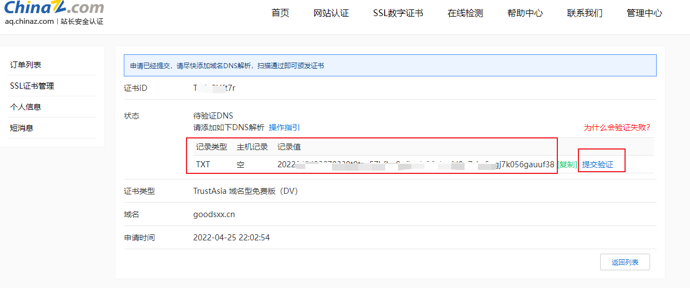

::: tip ✨✨✨✨✨
如何为域名添加免费的SSL证书
:::

<!-- more -->

## 申请SSL证书

1. 登录[站长之家](https://seo.chinaz.com/ "站长之家")，在首页用SEO综合查询搜索自己的域名，点击下方的'免费申请'

   
2. 选择品牌及证书型号，填写信息并提交

   
3. 填写完信息后，点击**下一步**

   
4. 选择手动DNS验证，点击**确认申请**

   
5. 按照操作指引，在自己的服务器控制台添加一条DNS解析记录，记录类型为**TXT**，记录值为如图所示的一串代码

   
6. DNS解析配置完成后店家**提交验证**，此步骤比较慢，可以耐心等待或者多尝试几次。
   验证成功后即可在左侧'SSL证书管理'中查看证书信息。

   

## 下载证书

1. 点击证书列表右侧的**下载**，将弹出如下窗口，下载类型选择**PEM_Nginx**

   
2. 证书下载解压后，将得到两个文件名以自己域名开头的两个证书文件

   

## 利用Nginx安装SSL证书

1. [在Linux上安装Nginx并设置开机启动](/docs/linux/installation-nginx.md)
2. 将上一步下载的两个证书文件上传至Nginx的配置文件**nginx.conft同级**的根目录下
3. 修改Nginx配置文件，并在**http节点**中添加如下代码

   ```shell
   # 编辑Nginx配置文件
   vi /etc/nginx/nginx.conft
   ```
   ```shell
   # 此处为正常部署网站的代理配置
   server{
     listen 80;
     listen [::]:80;
     server_name localhost;
     rewrite ^(.*) https://$host$1 permanent; # 需增加这一句，将80端口的所有请求都转为https

     location / {
        root html;
        index index.html index.htm;
      }
   }

   # 此处为ssl证书配置
   server{
      server_name goodsxx.cn;# 填写绑定证书的域名
      listen 443 ssl;
      ssl_certificate goodsxx.cn.crt;# 后缀为.crt的证书文件名
      ssl_certificate_key goodsxx.cn.key;# 后缀为.key的证书文件名
      ssl_session_timeout 5m;
      ssl_protocols TLSv1 TLSv1.1 TLSv1.2; # 按照这个协议配置
      ssl_ciphers ECDHE-RSA-AES128-GCM-SHA256:HIGH:!aNULL:!MD5:!RC4:!DHE; # 按照这个套件配置
      ssl_prefer_server_ciphers  on;

      location / {
        root html;# 站点目录
        index index.html index.htm;
        proxy_pass  http://goodsxx.cn:8000; # 此代理表示 访问https://goodsxx.cn将会指向http://goodsxx.cn:8000
      }
   }
   ```
4. 保存退出，重启Nginx即可使用https访问自己的域名
