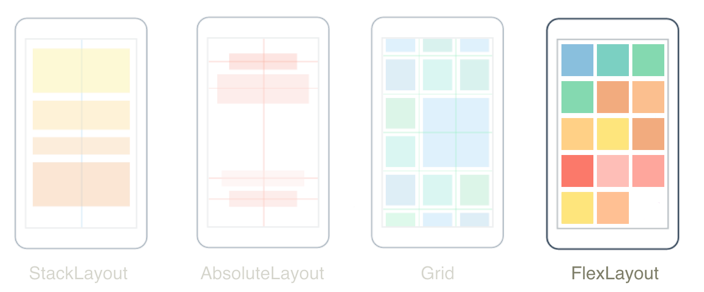

::: tip ✨✨✨✨✨
常用控件介绍
:::

<!-- more -->

## [Shell](https://learn.microsoft.com/zh-cn/dotnet/maui/fundamentals/shell/?view=net-maui-7.0)

### 概述

.NET MAUI 中 Shell 提供大多数应用所需的基本功能：

- 用于描述应用的视觉层次结构的单个位置。
- 常见的导航用户体验。
- 基于 URI 的导航方案，允许导航到应用中的任何页面。
- 集成的搜索处理程序。

Shell 表示应用的视觉层次结构，可以理解为应用的壳子，Shell类可以包含以下层次结构对象：

1. **`FlyoutItem`** 一个 FlyoutItem 表示浮出控件中的一个或多个项，并且应在应用导航模式需要浮出控件时使用。
2. **`TabBar`** 一个 TabBar 表示底部选项卡栏，并且应在应用导航模式以底部选项卡开头且不需要浮出控件时使用。
3. **`Tab`** 表示分组内容，可通过底部选项卡导航。每个 Tab 对象都是 FlyoutItem 对象或 TabBar 对象的子对象。
4. **`ShellContent`** 表示每个选项卡的 ContentPage 对象。

### 底部导航栏

一个 TabBar 对象可以包含一个或多个 Tab 对象，每个 Tab 对象表示底部选项卡栏上的一个选项卡。 每个 Tab 对象可以包含一个或多个 ShellContent 对象，每个 ShellContent 对象将显示单个 ContentPage。 当对象中Tab存在多个ShellContent对象时，ContentPage这些对象可通过顶部选项卡导航。 在选项卡中，可以导航到称为详细信息页的其他 ContentPage 对象。

#### 基本实现

代码：

```xml{10-26}
<?xml version="1.0" encoding="UTF-8" ?>
<Shell
    x:Class="Mediinfo_MAUI_Demo.AppShell"
    xmlns="http://schemas.microsoft.com/dotnet/2021/maui"
    xmlns:x="http://schemas.microsoft.com/winfx/2009/xaml"
    xmlns:local="clr-namespace:Mediinfo_MAUI_Demo"
    xmlns:view="clr-namespace:Mediinfo_MAUI_Demo.Views"
    Shell.FlyoutBehavior="Disabled">

    <TabBar>
        <ShellContent
            Icon="huanzheliebiao.png"
            Title="DemoPage1"
            ContentTemplate="{DataTemplate view:DemoPage1}"
            Route="DemoPage1" />
        <ShellContent
            Icon="bingqushouye.svg"
            Title="Home"
            ContentTemplate="{DataTemplate local:MainPage}"
            Route="MainPage" />
        <ShellContent
            Icon="renwu.png"
            Title="DemoPage2"
            ContentTemplate="{DataTemplate view:DemoPage2}"
            Route="DemoPage2" />
    </TabBar>

</Shell>
```
效果：


:::info
- `ShellContent.Icon` 导航栏按钮图标
- `ShellContent.Title` 导航栏按钮标题
- `ShellContent.ContentTemplate` 导航栏按钮对应的页面
- `ShellContent.Route` 生成的路由名称
:::

### 标题栏

.NET MAUI 的Shell组件会为 ShellContent 生成一个默认的标题栏，但很多时候我们需要在顶部标题栏提供额外的功能和信息，这往往是默认标题栏无法实现的，这时候我们就需要自定义标题栏来实现效果。
MAUI 的 Shell.TitleView 属性可以用来自定义顶部标题栏，下面是简单的使用方法：

```xml{9-17}
<ContentPage xmlns="http://schemas.microsoft.com/dotnet/2021/maui"
             xmlns:x="http://schemas.microsoft.com/winfx/2009/xaml"
             xmlns:controls="clr-namespace:Mediinfo_MAUI_Demo.Controls"
             xmlns:model="clr-namespace:Mediinfo_MAUI_Demo.Models"
             xmlns:viewmodel="clr-namespace:Mediinfo_MAUI_Demo.ViewModels"
             x:Class="Mediinfo_MAUI_Demo.MainPage"
             x:DataType="viewmodel:MainPageViewModel">

    <Shell.TitleView>
        <Border StrokeThickness="0" BackgroundColor ="#e6f6ff">
            <Label 
                HorizontalOptions="Center" 
                VerticalOptions="Center"
                FontAttributes="Bold"
                Text="病区首页"/>
        </Border>
    </Shell.TitleView>
  <!--其他代码-->
</ContentPage>
```

但或许效果并不是你预期的那样：


如果你发现顶部标题栏的左侧并没显示为正确的颜色，这是 .NET MAUI 的一个Bug，我们可以使用另一个属性来暂时解决这个问题：

```xml{9-11,13}
<ContentPage xmlns="http://schemas.microsoft.com/dotnet/2021/maui"
             xmlns:x="http://schemas.microsoft.com/winfx/2009/xaml"
             xmlns:controls="clr-namespace:Mediinfo_MAUI_Demo.Controls"
             xmlns:model="clr-namespace:Mediinfo_MAUI_Demo.Models"
             xmlns:viewmodel="clr-namespace:Mediinfo_MAUI_Demo.ViewModels"
             x:Class="Mediinfo_MAUI_Demo.MainPage"
             x:DataType="viewmodel:MainPageViewModel">

    <Shell.BackgroundColor>
        <Color>#e6f6ff</Color>
    </Shell.BackgroundColor>
    <Shell.TitleView>
        <Border StrokeThickness="0" BackgroundColor ="Transparent">
            <Label 
                HorizontalOptions="Center" 
                VerticalOptions="Center"
                FontAttributes="Bold"
                Text="自定义导航栏"/>
        </Border>
    </Shell.TitleView>
  <!--其他代码-->
</ContentPage>
```

我们通过 Shell.BackgroundColor 属性将 Shell 的背景色改为红色，再将 Shell.TitleView 下的根节点设为透明，如此我们便能实现预期的效果：


## 页面控件

### [ContentPage](https://learn.microsoft.com/zh-cn/dotnet/maui/user-interface/pages/contentpage?view=net-maui-7.0)


ContentPage 是 .NET MAUI 中最常用的页面类型，通常是页面的根节点。

```xml
<ContentPage xmlns="http://schemas.microsoft.com/dotnet/2021/maui"
             xmlns:x="http://schemas.microsoft.com/winfx/2009/xaml"
             x:Class="MyMauiApp.MyPage"
             Title="MyPage"
             BackgroundColor="White">
    <StackLayout>
        <Label Text="Welcome to .NET MAUI!"
                VerticalOptions="Center"
                HorizontalOptions="Center" />
        <!-- Other views go here -->
    </StackLayout>
</ContentPage>
```

## 布局控件

### 概述

.NET MAUI 布局控件允许你在应用程序中排列和分组 UI 控件。 选择布局类需要了解布局如何定位其子元素，以及布局如何调整其子元素的大小。 此外，可能需要嵌套布局来创建所需的布局。

### [StackLayout](https://learn.microsoft.com/zh-cn/dotnet/maui/user-interface/layouts/stacklayout?view=net-maui-7.0)


.NET MAUI 中 StackLayout 以水平或垂直方式在一展示内容。 默认情况下 StackLayout 是垂直方向排列。 此外，还可以将一个 StackLayout 用作包含其他子布局的父布局。
StackLayout 类定义了以下属性：

- **`Orientation`** 表示子视图的定位方向。 默认值为 Vertical。
- **`Spacing`** 表示每个子视图之间的空间量。 默认值为 0。

### [VerticalStackLayout](https://learn.microsoft.com/zh-cn/dotnet/maui/user-interface/layouts/verticalstacklayout?view=net-maui-7.0)

VerticalStackLayout 是更高性能的 StackLayout **垂直布局**替代方法。

### [HorizontalStackLayout](https://learn.microsoft.com/zh-cn/dotnet/maui/user-interface/layouts/horizontalstacklayout?view=net-maui-7.0)

HorizontalStackLayout 是更高性能的 StackLayout **水平布局**替代方法。

### [Grid](https://learn.microsoft.com/zh-cn/dotnet/maui/user-interface/layouts/grid?view=net-maui-7.0)


Grid 布局可将子级组织成行和列，这些行和列可以具有成比例或绝对大小。 默认情况下，Grid 包含一行和一列。 此外，还可以将一个 Grid 控件用作包含其他子布局的父布局。
需要注意的是，Grid 只能用作页面布局，不能当做表格来使用。

### [FlexLayout](https://learn.microsoft.com/zh-cn/dotnet/maui/user-interface/layouts/flexlayout?view=net-maui-7.0)



FlexLayout 布局可以以水平和垂直方式排列其子级，如果子级过多，则还可以包装子级，使其子级适合单行或列。 此外， FlexLayout 还可以控制方向和对齐方式，并适应不同的屏幕大小。

### [BindableLayout](https://learn.microsoft.com/zh-cn/dotnet/maui/user-interface/layouts/bindablelayout?view=net-maui-7.0)

BindableLayout 可绑定布局 可以使布局类控件通过绑定到集合来生成其内容，并可以选择使用 DataTemplate 设置每个项的外观。
BindableLayout  可绑定布局 具有下附加属性：

- **`ItemsSource`** 指定要由布局显示的 IEnumerable 集合。
- **`ItemTemplate`** 指定集合中的每个项的模板。
- **`ItemTemplateSelector`** 指定 DataTemplateSelector 用于在运行时为项选择模板。

## 视图控件

### [CollectionView](https://learn.microsoft.com/zh-cn/dotnet/maui/user-interface/controls/collectionview/?view=net-maui-7.0)

CollectionView 是一种使用不同布局规范呈现数据列表的视图。
