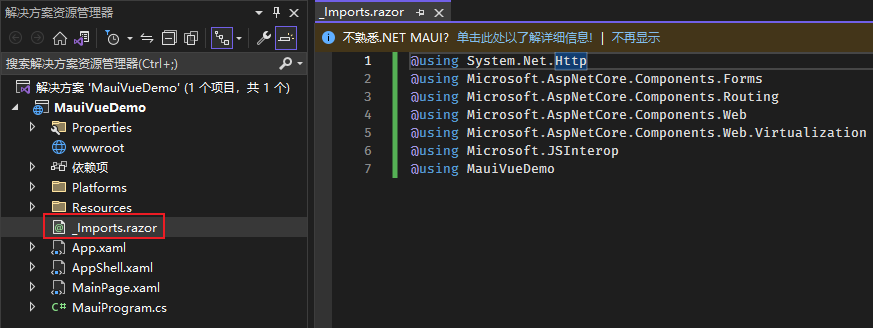

::: tip ✨✨✨✨✨
混合开发的概念是相对与原生开发来说的：App 不直接运行原生程序，而是在原生程序中运行一个 Web 程序，原生程序中包含 Web 运行时，用于承载 Web 页面。暂且将原生应用称之为 Web 容器，Web 容器应该能让 JavaScript 代码与原生平台的代码交互，互相调用，同时为上层提供交互逻辑，例如导航，事件，Cookie，刷新等内容。

本章我们将讲解如何利用 MAUI 中的 BlazorWebView 控件实现 MAUI + VUE 混合开发。
:::

<!-- more -->

## 创建项目

### 创建 .NET MAUI 应用


### 修改项目文件

右键项目-编辑项目文件


**Microsoft.NET.Sdk** 改为 **Microsoft.NET.Sdk.Razor**


保存修改后会自动引入所需的包


## 项目改造

### 新建 wwwroot 文件夹

这个文件夹将是混合开发 Web 部分的根目录，这个名称不能随便定义。


### 新建 _Imports.razor 文件

创建 _Imports.razor 文件并引用相关命名空间



```cs
@using System.Net.Http
@using Microsoft.AspNetCore.Components.Forms
@using Microsoft.AspNetCore.Components.Routing
@using Microsoft.AspNetCore.Components.Web
@using Microsoft.AspNetCore.Components.Web.Virtualization
@using Microsoft.JSInterop
@using MauiVueDemo
```

### 新建 Main.razor 文件

新建 Main.razor 文件并创建一个 Test 方法用于测试。


```cs
@inject IJSRuntime JSRuntime

@code {

    [JSInvokable]
    public static Task<string> Test()
    {
        return Task.FromResult("测试通过啦！");
    }
}
```

### MauiProgram 修改

添加 MauiBlazorWebView 服务及调试工具

```cs{17,20}
using Microsoft.Extensions.Logging;

namespace MauiVueDemo;

public static class MauiProgram
{
	public static MauiApp CreateMauiApp()
	{
		var builder = MauiApp.CreateBuilder();
		builder
			.UseMauiApp<App>()
			.ConfigureFonts(fonts =>
			{
				fonts.AddFont("OpenSans-Regular.ttf", "OpenSansRegular");
				fonts.AddFont("OpenSans-Semibold.ttf", "OpenSansSemibold");
			});
		builder.Services.AddMauiBlazorWebView();
#if DEBUG
		builder.Logging.AddDebug();
		builder.Services.AddBlazorWebViewDeveloperTools();
#endif
        return builder.Build();
	}
}
```

### MainPage 修改

::: tabs
@tab MainPage.xaml

HostPage="wwwroot/index.html" 对应 wwwroot 文件夹下的 index.html 文件

ComponentType="{x:Type local:Main}" 对应 Main.razor 文件

```xml{4,7-11}
<?xml version="1.0" encoding="utf-8" ?>
<ContentPage xmlns="http://schemas.microsoft.com/dotnet/2021/maui"
             xmlns:x="http://schemas.microsoft.com/winfx/2009/xaml"
             xmlns:local="clr-namespace:MauiVueDemo"
             x:Class="MauiVueDemo.MainPage">

    <BlazorWebView HostPage="wwwroot/index.html">
        <BlazorWebView.RootComponents>
            <RootComponent Selector="#blazorApp" ComponentType="{x:Type local:Main}" />
        </BlazorWebView.RootComponents>
    </BlazorWebView>

</ContentPage>
```

@tab MainPage.xaml.cs

```cs
namespace MauiVueDemo;

public partial class MainPage : ContentPage
{
	public MainPage()
	{
		InitializeComponent();
	}
}
```

:::

## 创建 Vue 项目

使用 `vue init webpack maui-vue` 命令创建名为 maui-vue 的项目


## Vue 项目改造

### index.html 修改

新增如下代码

```html{10-11}
<!DOCTYPE html>
<html>
  <head>
    <meta charset="utf-8">
    <meta name="viewport" content="width=device-width,initial-scale=1.0">
    <title>maui-vue</title>
  </head>
  <body>
    <div id="app"></div>
    <div id="blazorApp" style="display: none;">初始化服务用的</div>
    <script src="_framework/blazor.webview.js" autostart="false"></script>
  </body>
</html>
```

`<div id="blazorApp" style="display: none;">初始化服务用的</div>` 对应 MAUI 项目中 MainPage.xaml 页面中的 BlazorWebView.RootComponent.Selector 属性

`<script src="_framework/blazor.webview.js" autostart="false"></script>` 是BlazorWebView用来注册C#交互的，不可以缺少。

### HelloWorld.vue 修改

本项目中 HelloWorld.vue 为 Vue 项目的默认页面，不同版本创建的 Vue 项目默认页面可能不同。

`DotNet` 对象是 MAUI Blazor 中注入的交互操作对象，此处我们定义了一个Test方法调用C#中的方法并将返回值展示在页面中


```html{4-6,18-25}
<template>
  <div class="hello">
    <h1>{{ msg }}</h1>
    <div>
      <button @click="Test">测试调用C#代码</button>
    </div>
  </div>
</template>

<script>
export default {
  name: 'HelloWorld',
  data () {
    return {
      msg: 'Welcome to Your Vue.js App'
    }
  },
  methods:{
    async Test(){
      await DotNet.invokeMethodAsync("MauiVueDemo","Test")
      .then(res=>{
        this.msg = res
      })
    }
  }
}
</script>

<!-- Add "scoped" attribute to limit CSS to this component only -->
<style scoped>
h1, h2 {
  font-weight: normal;
}
ul {
  list-style-type: none;
  padding: 0;
}
li {
  display: inline-block;
  margin: 0 10px;
}
a {
  color: #42b983;
}
</style>
```

## 打包 Vue 项目

通过 `yarn build` 命令打包项目


## 迁移 Vue 项目打包文件

Vue 项目默认打包路径为 ./dist，拷贝 dist 文件夹下的所有文件至 MAUI 项目的 wwwroot 文件夹下。


## 启动 MAUI 项目


![点击 [测试调用C#代码] 按钮](./image/maui-vue-hunhekaifa/1672735773465.png)
