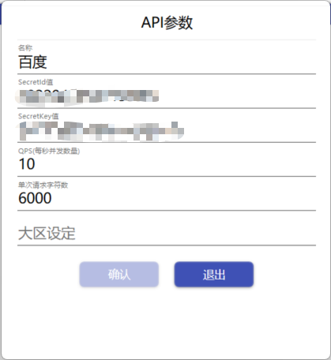

::: tip ✨✨✨✨✨
使用DotNetCoreZhHans翻译本地语言包，实现VS的中文代码提示
:::

<!-- more -->

## 下载DotNetCoreZhHans

### 最新版本：[DotNetCoreZhHans.exe](http://www.wyj55.cn/DotNetCoreZhHans.html)

### 备用地址：[DotNetCoreZhHans.exe](https://www.aliyundrive.com/s/DzDSHpTx6SG) 提取码: uo59

### Gitee地址：[dot-net-core-zh-hans-open](https://gitee.com/84819760/dot-net-core-zh-hans-open)

## 安装/启动 DotNetCoreZhHans

## 配置翻译API

### 1. 点击齿轮图标

### 2. 启动百度API，点击编辑图标，填写APPID及密钥

SecretId和SecretKey为百度翻译开放平台中的APP ID和密钥(需注册)

## 启动程序，进行本地语言包翻译

翻译后弹出的异常可以忽略

## 重启VS即可实现中文代码提示

